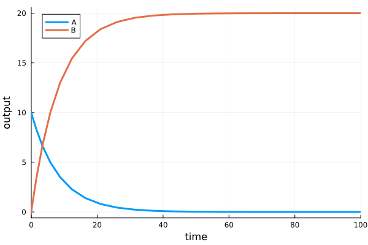

[](https://hetalang.github.io/)
[](https://juliahub.com/ui/Packages/HetaSimulator/IIE0h)
[](https://GitHub.com/hetalang/HetaSimulator.jl/issues/)
[](https://coveralls.io/github/hetalang/HetaSimulator.jl?branch=master)
[](https://hetalang.github.io/HetaSimulator.jl/stable)
[](https://github.com/hetalang/HetaSimulator.jl/blob/master/LICENSE)

# HetaSimulator

**HetaSimulator** is a Julia‑based simulation engine for models written
in the [Heta modeling language](https://hetalang.github.io).\
It is part of the **Heta project** and enables fast
simulations and analysis using the Julia [SciML](https://sciml.ai/)
ecosystem.

📚 **Full documentation:**\
<https://hetalang.github.io/HetaSimulator.jl/stable>

## Quick start

The example below creates a simple reaction model and runs a simulation.

### 1. Create a project directory
`
Create a new directory called **heta-simulation**

### 2. Create a model file

Create a file **`index.heta`** inside the directory:

```heta
comp1 @Compartment .= 1;

A @Species { compartment: comp1 } .= 10;
B @Species { compartment: comp1 } .= 0;
r1 @Reaction { actors: A => 2B } := k1 * A * comp1;

k1 @Const = 1.2e-1;
```

This model describes a simple reaction converting **A → B** inside a
compartment.

### 3. Create a simulation script

Create a file **`run.jl`**:

``` julia
using HetaSimulator, Plots

# load platform from the directory
# index.heta is the default entry point
platform = load_platform(".")
model = models(platform)[:nameless]

# create simulation scenario
scenario = Scenario(model, (0., 100.); observables = [:A, :B])

# simulate and plot results
results = sim(scenario)
plot(results)
```

### 4. Run the simulation

Run the script in Julia. You should see a plot showing the dynamics of species **A** and **B**.



## Installation

Make sure **Julia** is installed: <https://julialang.org/downloads/>

Then install the package in the Julia package manager:

``` julia
julia> ]
pkg> add HetaSimulator
```

## About Heta

[Heta](https://hetalang.github.io) is a domain‑specific modeling
language (DSL) for dynamic models used in quantitative systems
pharmacology (QSP) and systems biology.

HetaSimulator provides the Julia‑based simulation engine for running and
analyzing these models.

## Getting help

-   Documentation: <https://hetalang.github.io>
-   Issue tracker: <https://github.com/hetalang/HetaSimulator.jl/issues>

## License

This project is distributed under the terms of the **MIT License**.

Copyright © 2020-2026 InSysBio LLC
