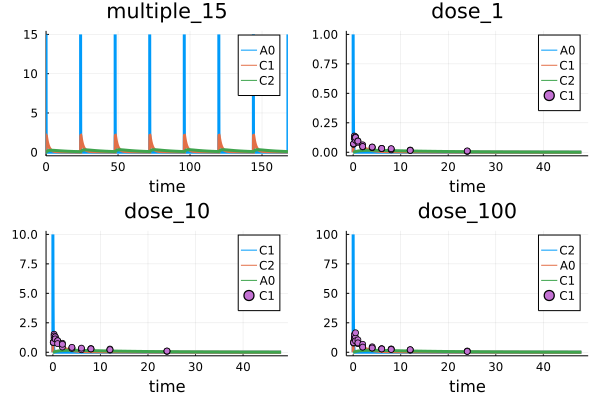

# Overview of HetaSimulator.jl

The general workflow for HetaSimulator is

- Writing a modeling platform in the Heta format
- Loading platform into Julia environment
- Creating model's settings and data adding conditions and measurements
- Solve problems using the methods: sim, mc, fit
- Analyze the results

The particular workflow may be iterative, i.e. include updates to the model and re-simulation based on estimated parameters or model structure updates. It depend on the user's needs.

## Writing model in the Heta format

Heta is a modeling language for quantitative systems pharmacology and systems biology.
It is a DSL (domain-specific language) describing dynamic model or models in process-description format.
Heta compiler converts it into variety of files including "Julia" format which can be loaded to Julia/HetaSimulator environment.

HetaSimulator supports all features of the [Heta language](https://hetalang.github.io/#/specifications/). So one can organize modeling project as re-used modules (files), include any number of models into single platform with the namespaces mechanism. The platform can use the declaration file __platform.json__ or can be loaded from single file. 
All Heta modules: Heta code, tables, SBML and JSON can be loaded as a modeling platform and compiled into ODE-based mathematical representation.

To read more about Heta-based modeling platforms and Heta compiler visit the homepage <https://hetalang.github.io/#/>.

As an example we will use a model describing a simple pharmacokinetic model stored in single __.heta__ file. It is expected that the model code will be placed into "index.heta" file located in a directory __my_example__ or something like that.

```julia
// Compartments
Vol0 @Compartment .= 1;
Vol1 @Compartment .= 6.3;
Vol2 @Compartment .= 10.6;

// Species
A0 @Species {compartment: Vol0, isAmount: true, output: true} .= 0;
C1 @Species {compartment: Vol1, output: true} .= 0;
C2 @Species {compartment: Vol2, output: true} .= 0;

// Reactions
v_abs @Reaction {actors: A0 = C1} := kabs * A0;
v_el @Reaction {actors: C1 =} := Vol1 * (kel * C1); // Vol1 * (kmax * C1 / (Km + C1));
v_distr @Reaction {actors: C1 = C2} := Q * (C1 - C2);

// Parameters
dose @Const = 20;
kabs @Const = 10;
kel @Const = 0.2;
Q @Const = 3.2;

// single dose event
sw1 @TimeSwitcher {start: 0};
A0 [sw1]= dose;

// multiple dose event, default off
sw2 @TimeSwitcher {start: 0, period: 24, active: false};
A0 [sw2]= dose;
```

The model describes a typical two-compartment model with single or multiple dose depending on which event is active.
Take a note that the component of the model is create without any `namespace` statement. This means they have the default namespace attribute `nameless`.
This code is equivalent to the following system of ODE.

```math
\begin{aligned}
&\frac{d}{dt}A_0 = - v_{abs}\\
&\frac{d}{dt}(C_1 \cdot Vol_1) = v_{abs} - v_{el} - v_{distr}\\
&\frac{d}{dt}(C_2 \cdot Vol_2) = v_{distr}\\
\\
&A_0(0) = 0\\
&C_1(0) = 0\\
&C_2(0) = 0\\
&v_{abs}(t) = kabs \cdot A_0\\
&v_{el}(t) = Vol_1 \cdot (kel \cdot C_1)\\
&v_{distr}(t) = Q \cdot (C_1 - C_2)\\
\end{aligned}\\
\\
\text{event at } t = 0\\
\\
A_0 = dose
```

Where parameters are

```math
\begin{aligned}
&dose = 20\\
&kabs = 10\\
&kel = 0.2\\
&Q  = 3.2\\
&Vol_1 = 6.3\\
&Vol_2 = 10.6\\
\end{aligned}\\
```

## Loading platform from the Heta format

HetaSimulator loads modeling platform into `Platform` type object that is a container for all models simulation settings and experimental data. When you load a platform from Heta it includes only models converted from `concrete namespaces`. The condition storage is empty and will be populated manually or imported from tables.

### Loading with internal compiler

When __HetaSimulator__ is installed and internal __Heta compiler__ is installed the platform can be loaded with the method [`load_platform`](@ref).

```julia
using HetaSimulator, Plots

p = load_platform("./my_example")
```

```julia
No declaration file, running with defaults...
[info] Builder initialized in directory "Y:\HetaSimulator.jl\cases\story_3".
[info] Compilation of module "index.heta" of type "heta"...
[info] Reading module of type "heta" from file "Y:\HetaSimulator.jl\cases\story_3\index.heta"...
[info] Setting references in elements, total length 50
[info] Checking for circular references in Records.
[warn] Units checking skipped. To turn it on set "unitsCheck: true" in declaration.
[info] Checking unit's terms.
[warn] "Julia only" mode
[info] Exporting to "Y:\HetaSimulator.jl\cases\story_3\_julia" of format "Julia"...
Compilation OK!
Loading platform... OK!
+---------------------------------------------------------------------------
| Platform contains:
|   1 model(s): nameless. Use `models(platform)` for details.
|   0 condition(s): . Use `conditions(platform)` for details.
+---------------------------------------------------------------------------
```

The first argument of `load_platform` declares the absolute or relative path to the platform directory.
If you use another file name (not __index.heta__) you can declare it with `source` argument.

```julia
p = load_platform("./my_example", source = "another_name.heta")
```

You can also load the model from another formats like SBML.

```julia
p = load_platform("./another_project", source = "model.xml", type = "SBML")
```
The list of additional arguments is approximately the same as [CLI options](https://hetalang.github.io/#/heta-compiler/cli-references?id=quotheta-buildquot-command) of `heta build` command of Heta compilers. For the full list see [`load_platform`](@ref) references.

### Loading pre-compiled platform

Alternatively you can use files generated with stand-alone [Heta compiler](https://hetalang.github.io/#/heta-compiler/).

To do so the model code should be updated with the following statement.

```heta
...
sw2 @TimeSwitcher {start: 0, period: 24, active: false};
A0 [sw2]= dose;

#export {format: Julia, filepath: julia_platform};
```

Running the code with the console command `heta build my_project` produces the file __my_project/dist/julia_platform/model.jl__ which can be loaded with [`load_jlplatform`](@ref) method.

```julia
p = load_jlplatform("./my_example/dist/julia_platform/model.jl")
```
```julia
Loading platform... OK!
+---------------------------------------------------------------------------
| Platform contains:
|   1 model(s): nameless. Use `models(platform)` for details.
|   0 condition(s): . Use `conditions(platform)` for details.
+---------------------------------------------------------------------------
```

## Creating conditions

`Cond` (condition) in HetaSimulator is an object which stores a model together with additional settings and options.
It sets the time point, ranges, updates parameter values, activate or inactivate events, etc.

The condition-based approach is used to store pre-defined model's options: dose values, experimental conditions, data saving options, initial values and others which can be applied for one or multiple models. The `Cond` also stores `Measurement` points which is used for parameters identification and visualization.

`Cond` is created from default options passed from its model and user defined options from table row or set manually.

### Import from CSV tables

The most simple way to populate a platform by conditions is to create a separate file with `Cond` in [tabular CSV format](../table-formats/cond.md).

Create file __conditions.csv__ file inside __my_example__ with the following content.

id|parameters.dose|events_active.sw1|events_active.sw2
--|--|--|--
dose_1|1|true|false
dose_10|10|true|false
dose_100|100|true|false
multiple_15|15|false|true

The table can be loaded with the [`read_conditions`](@ref) function.

```julia
cond_df = read_conditions("./my_example/conditions.csv")
```
```julia
4×4 DataFrame
 Row │ id           parameters.dose  events_active.sw1  events_active.sw2 
     │ Symbol       Int64            Bool               Bool
─────┼────────────────────────────────────────────────────────────────────
   1 │ dose_1                     1               true              false
   2 │ dose_10                   10               true              false
   3 │ dose_100                 100               true              false
   4 │ multiple_15               15              false               true
```

The function reads the content of CSV file, checks components and stores in `cond_df` variable of `DataFrame` format.

This should be loaded into `Platform` object.

```julia
add_conditions!(p, cond_df)
```

As we can see all 4 conditions from the table were added.

```julia
p
+---------------------------------------------------------------------------
| Platform contains:
|   1 model(s): nameless. Use `models(platform)` for details.
|   4 condition(s): multiple_15, dose_1, dose_10, dose_100. Use `conditions(platform)` for details.
+---------------------------------------------------------------------------
```

To get the particular condition you can use the following syntax.

```julia
condition1 = conditions(p)[:dose_1]
+---------------------------------------------------------------------------
| Cond contains:
|   0 saveat values: Float64[]. Use `saveat(cond)` for details.
|   tspan: (0.0, 48.0). Use `tspan(cond)` for details.
|   4 parameters(s). Use `parameters(cond)` for details.
|   0 measurement(s). Use `measurements(cond)` for details.
+---------------------------------------------------------------------------
```

See more about condition tables in [tabular CSV format](../table-formats/cond.md).

### Import from Excel tables

Instead of using CSV tables one can fill the XSLT file and load condition table in the same manner.

```julia
cond_df = read_conditions("./my_example/conditions.xlsx")
```
```julia
4×4 DataFrame
 Row │ id           parameters.dose  events_active.sw1  events_active.sw2 
     │ Symbol       Int64            Bool               Bool
─────┼────────────────────────────────────────────────────────────────────
   1 │ dose_1                     1               true              false
   2 │ dose_10                   10               true              false
   3 │ dose_100                 100               true              false
   4 │ multiple_15               15              false               true
```

### Manual creation

`Cond` objects can be created and loaded without any tables.

For example we need to create simulations with the default model 
- `dose = 100`
- event `sw2` is active 
- simulation time is from `0` to `1000`
- we need to observe all species: `A0`, `C1`, `C2`, and all reactions: `v_abs`, `v_el`, `v_distr`

Condition can be created with the following code

```julia
# to get the default model
model = models(p)[:nameless] 
# creating condition
new_condition = Cond(
    model,
    parameters = [:dose=>100.],
    events_active = [:sw1=>false, :sw1=>true],
    tspan = (0.,1000.),
    observables = [:A0, :C1, :C2, :v_abs, :v_el, :v_distr]
    ) 

+---------------------------------------------------------------------------
| Cond contains:
|   0 saveat values: Float64[]. Use `saveat(cond)` for details.
|   tspan: (0.0, 1000.0). Use `tspan(cond)` for details.
|   4 parameters(s). Use `parameters(cond)` for details.
|   0 measurement(s). Use `measurements(cond)` for details.
+---------------------------------------------------------------------------
```

See more options in API docs for [`Cond`](@ref) function.

To load it into `Platform` container use the following syntax.

```julia
push!(conditions(p), :multiple_100=>new_condition)
```

where `multiple_100` is an identifier for the condition in the dictionary.

## Creating measurements

`Measurement` in HetaSimulator is representation of experimentally measured value for parameter identification.
Each `Measurement` is associated with some particular condition, observable value and fixed time point.

All measurements in the platform are used to calculate the log-likelihood function when required. Measurements are stored inside `Cond` objects.

### Import from CSV tables

User can load measurement points from one or several tables which follow [table format](./table-formats/measurement).

Create file __measurements.csv__ file inside __my_example__ with the following structure.

_Full file can be downloaded from here: [measurements.csv](https://raw.githubusercontent.com/hetalang/hetasimulator/master/case/story_3/measurements.csv)_

t|measurement|prob.mean|prob.sigma|condition
--|--|--|--|--
0.08333|0.0686283|C1|sigma1|dose_1
0.08333|0.0684679|C1|sigma1|dose_1
0.08333|0.0726338|C1|sigma1|dose_1
0.25|0.119397|C1|sigma1|dose_1
0.25|0.137662|C1|sigma1|dose_1
0.25|0.120412|C1|sigma1|dose_1
0.5|0.131784|C1|sigma1|dose_1
...|...|...|...|...

The table can be loaded with the [`read_measurements`](@ref) function.

```julia
measurements_df = read_measurements("./cases/story_3/measurements.csv")
90×5 DataFrame
 Row │ t         measurement  prob.mean  prob.sigma  condition 
     │ Float64   Float64      String     String      Symbol    
─────┼─────────────────────────────────────────────────────────
   1 │  0.08333    0.0686283  C1         sigma1      dose_1
   2 │  0.08333    0.0684679  C1         sigma1      dose_1
   3 │  0.08333    0.0726338  C1         sigma1      dose_1
   4 │  0.25       0.119397   C1         sigma1      dose_1
   5 │  0.25       0.137662   C1         sigma1      dose_1
  ⋮  │    ⋮           ⋮           ⋮          ⋮           ⋮
  87 │ 12.0        2.189      C1         sigma3      dose_100
  88 │ 24.0        0.877502   C1         sigma3      dose_100
  89 │ 24.0        1.036      C1         sigma3      dose_100
  90 │ 24.0        0.724612   C1         sigma3      dose_100
                                                81 rows omitted
```

The function reads the content of CSV file, checks components and stores in `measurements_df` variable of `DataFrame` format.

To load measurements into `Platform` function [`add_measurements`](@ref) can be used. The function converts all rows into a series of `Measurements` and associate them with condition declared in `condition` value.

```julia
add_measurements!(p, measurements_df)
```

### Import from Excel tables

Instead of using CSV tables one can fill the XSLT file and load measurements table in the same manner.

```julia
measurements_df = read_measurements("./my_example/measurements.xlsx")
```

## Solving problems

There are three main problem types that can currently be solved with HetaSimulator:

- [__Simulation__](#simulation) of time-dependence for selected observables for one or several conditions using [`sim`](@ref) method.
- [__Monte-Carlo__](#montecarlo) type simulations that performs repeated simulations based on pre-set parameters distributions with [`mc`](@ref) method.
- [__Fitting__](#fitting) or parameter identification problem that optimizes values of selected model constants to reach the minimal discrepancy between simulations and experimental values which is solved by [`fit`](@ref) method.

Each method returns the solution of its specific type: `SimResults`, `MCResults` and `FitResults` or other types that include them.

The methods can be applied on different levels: `Platform`, `Cond` or `Model` to allow applying all conditions in the platform, some of them or the default one.
Some important "target vs method" variants are shown in the next table.

Target | Method | Results | Comments
-- | -- | -- | --
`Platform` | `sim` | `Vector{Pair{Symbol,SimResults}}` | All or selected list of conditions in model will run
`Cond` | `sim` | `SimResults` | Only target condition will run
`Model` | `sim` | `SimResults` | The condition created from default model's options will run
`Platform` | `mc` | `Vector{Pair{Symbol,MCResults}}` | All or selected list of conditions in model will run multiple times.
`Cond` | `mc` | `MCResults` | Target condition will run multiple times
`Model` | `mc` | `SimResults` | The default condition will run multiple times
`Platform` | `fit` | `FitResults` | All or selected list of conditions together their measurements will be used to optimize parameters.

*This page provides the example of applying methods on the `Platform` level only*

See more information for each method in extended description: [sim explanations](./sim.md), [mc explanations](./mc.md), [fit explanations](./fit.md).

### Simulation

On the previous steps we created the platform `p` and populated it with 4 conditions and measurement points.

Without additional preparations we can simulate the platform which means running all 4 conditions and combining all results into one object.

```julia
res = sim(p)
```
```julia
+---------------------------------------------------------------------------
| Simulation results for 4 condition(s).
| [:multiple_15 => ..., :dose_1 => ..., :dose_10 => ..., :dose_100 => ...]
| Use `sol[id]` to get component by id.
| Use `sol[i]` to get component by number.
| Use `DataFrame(sol)` to transform.
| Use `plot(sol)` to plot results.
+---------------------------------------------------------------------------
```

The whole solution consists of parts which corresponds to number of conditions in Platform.

The results can be plotted using default `plot` method.

```julia
plot(res)
```



The whole solution can also be translated into `DataFrame`.

```julia
res_df = DataFrame(res)
```
```julia
964×6 DataFrame
 Row │ t             A0           C1           C2           scope   condition   
     │ Float64       Float64      Float64      Float64      Symbol  Symbol      
─────┼──────────────────────────────────────────────────────────────────────────
   1 │  0.0           0.0         0.0          0.0          ode_    multiple_15
   2 │  0.0          15.0         0.0          0.0          sw2     multiple_15
  ⋮  │      ⋮             ⋮            ⋮            ⋮         ⋮          ⋮
 963 │ 47.9581        4.55058e-7  0.201956     0.2561       ode_    dose_100
 964 │ 48.0           2.99302e-7  0.201417     0.255416     ode_    dose_100
                                                                960 rows omitted
```

User can work with the solution component by using indexing by component number, like here `res[1]` or by condition id `res[:dose_1]`.

Any component can also be transformed into `DataFrame`.

```julia
res_df1 = DataFrame(res[1])
```
```julia
626×5 DataFrame
 Row │ t              A0           C1           C2           scope  
     │ Float64        Float64      Float64      Float64      Symbol 
─────┼──────────────────────────────────────────────────────────────
   1 │   0.0           0.0         0.0          0.0          ode_
   2 │   0.0          15.0         0.0          0.0          sw2
   3 │   6.66622e-6   14.999       0.000158714  1.59703e-10  ode_
   4 │   7.33284e-5   14.989       0.00174523   1.93194e-8   ode_
   5 │   0.000739951  14.8894      0.0175482    1.96242e-6   ode_
   6 │   0.00527893   14.2287      0.122199     9.82366e-5   ode_
   7 │   0.0141793    13.017       0.313149     0.000686265  ode_
   8 │   0.027481     11.3957      0.566335     0.00245837   ode_
  ⋮  │       ⋮             ⋮            ⋮            ⋮         ⋮
 620 │ 166.734         4.55058e-7  0.193317     0.245144     ode_
 621 │ 167.085         4.55058e-7  0.189038     0.239719     ode_
 622 │ 167.436         4.55058e-7  0.184854     0.234413     ode_
 623 │ 167.786         4.55058e-7  0.180762     0.229224     ode_
 624 │ 168.0           7.00046e-8  0.178314     0.22612      ode_
 625 │ 168.0           7.00046e-8  0.178314     0.22612      ode_
 626 │ 168.0          15.0         0.178314     0.22612      sw2
                                                    611 rows omitted
```

The component can also be plotted.

```julia
plot(res[1])
```


### Monte-Carlo

Monte-Carlo method runs simulation many times combining all simulations into single object `MCResults`.
You should clarify here the distribution of random parameters and number of iterations.

```julia
mc_res = mc(p, [:kabs=>Normal(10.,1e-1), :kel=>Normal(0.2,1e-3)], 1000)
```
```julia
+---------------------------------------------------------------------------
| Monte-Carlo results for 4 condition(s).
| [:multiple_15 => ..., :dose_1 => ..., :dose_10 => ..., :dose_100 => ...]
| Use `sol[id]` to get component by id.
| Use `sol[i]` to get component by number.
| Use `DataFrame(sol)` to transform.
| Use `plot(sol)` to plot results.
+---------------------------------------------------------------------------
```

To transform everything into `DataFrame`
```julia
mc_df = DataFrame(mc_res)
```

To plot everything use `plot`
```julia
plot(mc_res)
```
