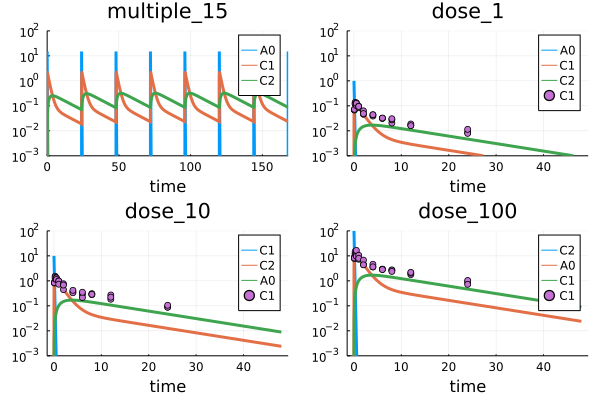

# Quick start

The general HetaSimulator workflow is:

- Write a model (modeling platform) in Heta format
- Load the platform into Julia environment
- Create simulation conditions by adding scenarios
- Simulate the model and estimate the parameters with: `sim`, `mc`, `fit`
- Analyze the results

The particular workflow may be iterative, i.e. the model can be re-simulated multiple times with new parameters values or structural updates. 

## Writing model in the Heta format

Heta is a modeling language for quantitative systems pharmacology (QSP) and systems biology (SB).
It is a DSL (domain-specific language) describing dynamic model or multiple models in process-description format.
Heta compiler converts it into variety of formats including Julia code, which can be loaded to Julia/HetaSimulator environment.

HetaSimulator supports all features of the [Heta language](https://hetalang.github.io/#/specifications/). One can organize modeling project with re-used modules (files), include any number of models into a single platform with the namespaces mechanism. The platform can use the declaration file __platform.yml__ or can be loaded directly from the heta file. 
All Heta modules: Heta code, tables, SBML and JSON can be loaded as a modeling platform and compiled into ODE-based mathematical representation.

To read more about Heta-based modeling platforms and Heta compiler visit the homepage <https://hetalang.github.io/#/>.

As an example we will use a simple pharmacokinetic model stored in single __.heta__ file. It is expected that the model code will be placed into "index.heta" file located in a directory __my\_example__ or something like that.

```julia
// Compartments
Vol0 @Compartment .= 1;
Vol1 @Compartment .= 6.3;
Vol2 @Compartment .= 10.6;

// Species
A0 @Species {compartment: Vol0, isAmount: true, output: true} .= 0;
C1 @Species {compartment: Vol1, output: true} .= 0;
C2 @Species {compartment: Vol2, output: true} .= 0;

// Reactions
v_abs @Reaction {actors: A0 = C1} := kabs * A0;
v_el @Reaction {actors: C1 =} := Vol1 * (kel * C1); // Vol1 * (kmax * C1 / (Km + C1));
v_distr @Reaction {actors: C1 = C2} := Q * (C1 - C2);

// Parameters
dose @Const = 20;
kabs @Const = 20;
kel @Const = 0.5;
Q @Const = 1.0;

// single dose event
sw1 @TimeSwitcher {start: 0};
A0 [sw1]= dose;

// multiple dose event, default off
sw2 @TimeSwitcher {start: 0, period: 24, active: false};
A0 [sw2]= dose;
```

The model describes a typical two-compartment model with single or multiple dose depending on which event is active.
Take a note that the component of the model is create without any `namespace` statement. This means they have the default namespace attribute `nameless`.
This code is equivalent to the following system of ODE.

```math
\begin{aligned}
&\frac{d}{dt}A_0 = - v_{abs}\\
&\frac{d}{dt}(C_1 \cdot Vol_1) = v_{abs} - v_{el} - v_{distr}\\
&\frac{d}{dt}(C_2 \cdot Vol_2) = v_{distr}\\
\\
&A_0(0) = 0\\
&C_1(0) = 0\\
&C_2(0) = 0\\
&v_{abs}(t) = kabs \cdot A_0\\
&v_{el}(t) = Vol_1 \cdot (kel \cdot C_1)\\
&v_{distr}(t) = Q \cdot (C_1 - C_2)\\
\end{aligned}\\
\\
\text{event at } t = 0\\
\\
A_0 = dose
```

Where parameters are

```math
\begin{aligned}
&dose = 20\\
&kabs = 10\\
&kel = 0.2\\
&Q  = 3.2\\
&Vol_1 = 6.3\\
&Vol_2 = 10.6\\
\end{aligned}\\
```

## Loading platform from the Heta format

HetaSimulator loads modeling platform into `Platform` type object that is a container for all models simulation settings and experimental data. When you load a platform from Heta it includes only models converted from `concrete namespaces`. The scenario storage is empty and will be populated manually or imported from tables.

### Loading with internal compiler

When __HetaSimulator__ is installed and internal __Heta compiler__ is installed the platform can be loaded with [`load_platform`](@ref).

```julia
using HetaSimulator, Plots

p = load_platform("./my_example")
```

```julia
No declaration file, running with defaults...
[info] Builder initialized in directory "Y:\my_example".
[info] Compilation of module "index.heta" of type "heta"...
[info] Reading module of type "heta" from file "Y:\my_example\index.heta"...
[info] Setting references in elements, total length 50
[info] Checking for circular references in Records.
[warn] Units checking skipped. To turn it on set "unitsCheck: true" in declaration.
[info] Checking unit's terms.
[warn] "Julia only" mode
[info] Exporting to "Y:\my_example\_julia" of format "Julia"...
Compilation OK!
Loading platform... OK!

Platform with 1 model(s), 0 scenario(s), 0 measurement(s)
   Models: nameless
   Scenarios:    
```

The first argument of `load_platform` declares the absolute or relative path to the platform directory.
If you use another file name (not __index.heta__) you can declare it with `source` argument.

```julia
p = load_platform("./my_example", source = "another_name.heta")
```

You can also load the model from another formats like SBML.

```julia
p = load_platform("./another_project", source = "model.xml", type = "SBML")
```
The list of additional arguments is approximately the same as [CLI options](https://hetalang.github.io/#/heta-compiler/cli-references?id=quotheta-buildquot-command) `heta build` command in Heta compiler. For the full arguments list see [`load_platform`](@ref) references.

### Loading pre-compiled platform

Alternatively you can use files generated with stand-alone [Heta compiler](https://hetalang.github.io/#/heta-compiler/).

To do so the model code should be build with `--export Julia` options.

```heta
...
sw2 @TimeSwitcher {start: 0, period: 24, active: false};
A0 [sw2]= dose;
```

Running the code with the console command `heta build --export Julia my_project` produces the file __my\_example/dist/julia/model.jl__ which can be loaded with [`load_jlplatform`](@ref) method.

```julia
p = load_jlplatform("./my_example/dist/julia/model.jl")
```
```julia
Loading platform... OK!
Platform with 1 model(s), 0 scenario(s), 0 measurement(s)
   Models: nameless
   Scenarios:   
```

## Creating scenarios

`Scenario` in HetaSimulator is an object which stores a model together with additional settings and options.
It sets the saving time point, time span, specific parameters' values, active and inactive events, etc.

The scenario-based approach is used to store pre-defined model's options: dose values, experimental scenarios, saving options, initial values and other settings, which can be applied for one or multiple models. The `Scenario` also stores `Measurement` points which are used for parameters estimation and visualization.

`Scenario` is created from the default or user defined options. It can be imported from Scenario and Measurement tables or set directly in Julia code.

### Import from CSV tables

The most simple way to populate a platform with scenarios is to create a separate `Scenario` file in [tabular CSV format](../table-formats/scenario.md).

Create file __scenarios.csv__ file inside __my\_example__ with the following content.

|id|parameters.dose|events_active.sw1|events_active.sw2|
|---|---|---|---|
|dose_1|1|true|false|
|dose_10|10|true|false|
|dose_100|100|true|false|
|multiple_15|15|false|true|

The table can be loaded with the [`read_scenarios`](@ref) function.

```julia
scn_df = read_scenarios("./my_example/scenarios.csv")
```
```julia
4×4 DataFrame
 Row │ id           parameters.dose  events_active.sw1  events_active.sw2 
     │ Symbol       Int64            Bool               Bool
─────┼────────────────────────────────────────────────────────────────────
   1 │ dose_1                     1               true              false
   2 │ dose_10                   10               true              false
   3 │ dose_100                 100               true              false
   4 │ multiple_15               15              false               true
```

The function reads the content of CSV file, checks components present in the model and stores scenario table in `scn_df` variable of `DataFrame` format.

The scenario table should be loaded into `Platform` object.

```julia
add_scenarios!(p, scn_df)
```

As we can see all 4 scenarios were added from the table .

```julia
p
Platform with 1 model(s), 4 scenario(s), 0 measurement(s)
   Models: nameless
   Scenarios: dose_1, dose_10, dose_100, multiple_15
```

To get the particular scenario you can use the following syntax.

```julia
scenario1 = scenarios(p)[:dose_1]
Scenario for tspan=(0.0, 48.0)
   Time range (tspan): (0.0, 48.0)
   Parameters: dose, kabs, kel, Q, sigma1, sigma2, sigma3
   Number of measurement points: 0
```

See more about scenario tables in [tabular CSV format](../table-formats/scenario.md).

### Import from Excel tables

Instead of using CSV tables one can use XLSX file and load scenario table in the same manner.

```julia
scn_df = read_scenarios("./my_example/scenarios.xlsx")
```
```julia
4×4 DataFrame
 Row │ id           parameters.dose  events_active.sw1  events_active.sw2 
     │ Symbol       Int64            Bool               Bool
─────┼────────────────────────────────────────────────────────────────────
   1 │ dose_1                     1               true              false
   2 │ dose_10                   10               true              false
   3 │ dose_100                 100               true              false
   4 │ multiple_15               15              false               true
```

### Manual creation

`Scenario` objects can be created and loaded without any tables.

For example we need to create scenarios with the default model 
- `dose = 100`
- event `sw2` is active 
- simulation time is from `0` to `1000`
- we need to observe all species: `A0`, `C1`, `C2`, and all reactions: `v_abs`, `v_el`, `v_distr`

Scenario can be created with the following code

```julia
# to get the default model
model = models(p)[:nameless] 
# creating scenario
new_scenario = Scenario(
    model,
    (0.,1000.);
    parameters = [:dose=>100.],
    events_active = [:sw1=>false, :sw1=>true],
    observables = [:A0, :C1, :C2, :v_abs, :v_el, :v_distr]
    ) 
```

```
Scenario for tspan=(0.0, 1000.0)
   Time range (tspan): (0.0, 1000.0)
   Parameters: dose, kabs, kel, Q, sigma1, sigma2, sigma3
   Number of measurement points: 0
```

See more options in API docs section for [`Scenario`](@ref) function.

To load it into `Platform` container use the following syntax.

```julia
push!(scenarios(p), :multiple_100=>new_scenario)
```

where `multiple_100` is an identifier of the scenario in the dictionary.

## Creating measurements

`Measurement` in HetaSimulator is a representation of experimentally measured values.
Each `Measurement` is associated with some particular scenario, observable variable and fixed time point.

All measurements in the platform are used to calculate the log-likelihood function when required. Measurements are stored inside `Scenario` objects.

### Import from CSV tables

User can load measurement points from one or several tables which follow [table format](@ref measurement).

Create __measurements.csv__ file inside __my\_example__ with the following structure.

Full file can be downloaded from here: [measurements.csv](https://raw.githubusercontent.com/hetalang/hetasimulator/master/case/story_3/measurements.csv)

t|measurement|prob.mean|prob.sigma|scenario
---|---|---|---|---
0.08333|0.0686283|C1|sigma1|dose_1
0.08333|0.0684679|C1|sigma1|dose_1
0.08333|0.0726338|C1|sigma1|dose_1
0.25|0.119397|C1|sigma1|dose_1
0.25|0.137662|C1|sigma1|dose_1
0.25|0.120412|C1|sigma1|dose_1
0.5|0.131784|C1|sigma1|dose_1
...|...|...|...|...

The table can be loaded with the [`read_measurements`](@ref) function.

```julia
measurements_df = read_measurements("./cases/story_3/measurements.csv")
90×5 DataFrame
 Row │ t         measurement  prob.mean  prob.sigma  scenario 
     │ Float64   Float64      String     String      Symbol    
─────┼─────────────────────────────────────────────────────────
   1 │  0.08333    0.0686283  C1         sigma1      dose_1
   2 │  0.08333    0.0684679  C1         sigma1      dose_1
   3 │  0.08333    0.0726338  C1         sigma1      dose_1
   4 │  0.25       0.119397   C1         sigma1      dose_1
   5 │  0.25       0.137662   C1         sigma1      dose_1
  ⋮  │    ⋮           ⋮           ⋮          ⋮           ⋮
  87 │ 12.0        2.189      C1         sigma3      dose_100
  88 │ 24.0        0.877502   C1         sigma3      dose_100
  89 │ 24.0        1.036      C1         sigma3      dose_100
  90 │ 24.0        0.724612   C1         sigma3      dose_100
                                                81 rows omitted
```

The function reads the content of CSV file, checks components present in the model and stores the measurements in `measurements_df` variable of `DataFrame` format.

[`add_measurements!`](@ref) can be used to load measurements into `Platform` container. The function converts all rows into a series of `Measurements` and links them with scenarios declared in `scenario` field of the `Platform`.

```julia
add_measurements!(p, measurements_df)
```

### Import from Excel tables

Instead of using CSV tables one can fill the XLSX file and load measurements table in the same manner.

```julia
measurements_df = read_measurements("./my_example/measurements.xlsx")
```

## Solving problems

Three main problem types that can currently be solved with HetaSimulator:

- [__Simulation__](#Simulation) of time-dependence for selected observables for one or several scenarios using [`sim`](@ref) method.
- [__Monte-Carlo__](#Monte-Carlo) type simulations that perform repeated simulations based on pre-set parameters distributions with [`mc`](@ref) method.
- [__Fitting__](#Fitting) or parameters estimation problem that optimizes the values of the selected model-level parameters (`@Const`) to reach the minimal discrepancy between simulations and experimental data using [`fit`](@ref) method.

Each method returns the solution of its specific type: `SimResult`, `MCResult` and `FitResult` or vector types that include them.

The methods can be applied on different levels: `Platform`, `Scenario` or `Vector` of scenarios to select all scenarios in the platform, some of them or the default one.
Some important "target vs method" variants are shown in the next table.

Target | Method | Results | Comments
--- | --- | --- | ---
`Platform` | `sim` | `Vector{Pair{Symbol,SimResult}}` | All or selected list of scenarios in model will be simulated
`Scenario` | `sim` | `SimResult` | Only target scenario will be simulated
`Platform` | `mc` | `Vector{Pair{Symbol,MCResult}}` | All or selected list of scenarios in model will be simulated multiple times.
`Scenario` | `mc` | `MCResult` | Target scenario will be simulated multiple times
`Platform` | `fit` | `FitResult` | All or selected list of scenarios together their measurements will be used to optimize the parameters.

*This page provides an example of applying these methods to the `Platform` type only*

See more information for each method in the tutorials: [sim](../tutorial/sim.md), [mc explanations](../tutorial/mc.md), [fit explanations](../tutorial/fit.md).

### Simulation

See more details about `sim` method in [sim method](../tutorial/sim.md) tutorial.

On the previous steps we have created the platform `p` and populated it with 4 scenarios and measurement points.

Without additional preparations we can simulate the platform which means running all 4 scenarios and combining all results into one output object.

```julia
res = sim(p)
```

```
5-element Vector{Pair{Symbol, SimResult}}
    :dose_1 => 80x3 SimResult with status :Success.
    :dose_10 => 100x3 SimResult with status :Success.
    :dose_100 => 124x3 SimResult with status :Success.
    :multiple_15 => 668x3 SimResult with status :Success.
    :multiple_100 => 163x6 SimResult with status :Success.
```

The whole solution includes `SimResult`s for relevant `Scenario` identifiers.

The results can be visualized using default `plot` method.

```julia
plot(res)
```


The whole solution can also be transformed into `DataFrame`.

```julia
res_df = DataFrame(res)
```
```julia
1031×6 DataFrame
  Row │ t             A0            C1           C2           scope   scenario   
      │ Float64       Float64       Float64      Float64      Symbol  Symbol      
──────┼───────────────────────────────────────────────────────────────────────────
    1 │  0.0           0.0          0.0          0.0          ode_    multiple_15
    2 │  0.0          15.0          0.0          0.0          sw2     multiple_15
    3 │  3.33311e-6   14.999        0.000158714  2.49537e-11  ode_    multiple_15
    4 │  3.66642e-5   14.989        0.00174525   3.0187e-9    ode_    multiple_15
  ⋮   │      ⋮             ⋮             ⋮            ⋮         ⋮          ⋮
 1029 │ 45.1252       -3.9532e-26   0.0292381    0.108637     ode_    dose_100
 1030 │ 47.5238        3.29325e-27  0.0247767    0.0920607    ode_    dose_100
 1031 │ 48.0          -6.75365e-28  0.0239764    0.089087     ode_    dose_100
                                                                 1024 rows omitted
```

User can work with the solution component by using indexing by component number, like here `res[1]` or by scenario id `res[:dose_1]`.

Any component can also be transformed into `DataFrame`.

```julia
res_df1 = DataFrame(res[1])
```
```julia
702×6 DataFrame
 Row │ t              A0            C1           C2           scope   scenario   
     │ Float64        Float64       Float64      Float64      Symbol  Symbol      
─────┼────────────────────────────────────────────────────────────────────────────
   1 │   0.0           0.0          0.0          0.0          ode_    multiple_15
   2 │   0.0          15.0          0.0          0.0          sw2     multiple_15
   3 │   3.33311e-6   14.999        0.000158714  2.49537e-11  ode_    multiple_15
   4 │   3.66642e-5   14.989        0.00174525   3.0187e-9    ode_    multiple_15
  ⋮  │       ⋮             ⋮             ⋮            ⋮         ⋮          ⋮
 700 │ 168.0           2.79899e-18  0.0232934    0.0865488    ode_    multiple_15
 701 │ 168.0           2.79899e-18  0.0232934    0.0865488    ode_    multiple_15
 702 │ 168.0          15.0          0.0232934    0.0865488    sw2     multiple_15
                                                                  695 rows omitted
```

A single `SimResult` can also be selected for visualization.

```julia
plot(res[1])
```


### Monte-Carlo

Monte-Carlo method runs simulation many times combining all results into single `MCResult` object.
You should set the distribution of parameters and the number of iterations.

```julia
mc_res = mc(p, [:kabs=>Normal(10.,1e-1), :kel=>Normal(0.2,1e-3)], 1000)
```

```julia
5-element Vector{Pair{Symbol, MCResult}}
    :dose_1 => 1000x?x71 MCResult with status :Success x 1000
    :dose_10 => 1000x?x88 MCResult with status :Success x 1000
    :dose_100 => 1000x?x155 MCResult with status :Success x 1000
    :multiple_15 => 1000x?x583 MCResult with status :Success x 1000
    :multiple_100 => 1000x?x238 MCResult with status :Success x 1000
```

To transform all results into `DataFrame`
```julia
mc_df = DataFrame(mc_res)
```
```julia
946000×7 DataFrame
    Row │ iter   t             A0           C1           C2           scope   scenario   
        │ Int64  Float64       Float64      Float64      Float64      Symbol  Symbol      
────────┼─────────────────────────────────────────────────────────────────────────────────
      1 │     1   0.0           0.0         0.0          0.0          ode_    multiple_15 
      2 │     1   0.0          15.0         0.0          0.0          sw2     multiple_15
      3 │     1   6.67001e-6   14.999       0.000158714  4.99357e-11  ode_    multiple_15
      4 │     1   7.33701e-5   14.989       0.00174525   6.04082e-9   ode_    multiple_15
      5 │     1   0.000740371  14.8894      0.0175505    6.13689e-7   ode_    multiple_15
      6 │     1   0.00602741   14.1231      0.139042     3.99353e-5   ode_    multiple_15
   ⋮    │   ⋮         ⋮             ⋮            ⋮            ⋮         ⋮          ⋮
 945996 │  1000  46.6664        4.55058e-7  0.247023     0.484307     ode_    dose_100
 945997 │  1000  47.0172        4.55058e-7  0.243049     0.476516     ode_    dose_100
 945998 │  1000  47.3681        4.55059e-7  0.239139     0.46885      ode_    dose_100
 945999 │  1000  47.719         4.55058e-7  0.235292     0.461307     ode_    dose_100
 946000 │  1000  48.0           1.28404e-7  0.232256     0.455355     ode_    dose_100
                                                                       945989 rows omitted
```

To plot everything use `plot`
```julia
plot(mc_res)
```


### Fitting

The following steps are required to run the parameters estimation problem:

- Be sure that measurement points are loaded in a proper way: referred `Scenario`s exist, the proper error model is chosen.
- If required add distribution-related noise parameters into the model code, like `sigma` etc.
- Select a set of parameters which will be fitted and set initial values for them.

For the presented example we use normal distribution of measurement error with unknown variance parameters `sigma1`, `sigma2`, `sigma3` for doses 1, 10 and 100.

We need to add this unknown parameters into the Heta code and update the initial model:

```heta
...
A0 [sw2]= dose;

// parameters for fitting
sigma1 @Const = 0.1;
sigma2 @Const = 0.1;
sigma3 @Const = 0.1;
```

Take a note that the model compilation and loading `Scenario`s  and `Measurement`s should be repeated because `p` object was rebuild.

```julia
p = load_platform("$HetaSimulatorDir/cases/story_3")

scn_df = read_scenarios("$HetaSimulatorDir/cases/story_3/scenarios.csv")
add_scenarios!(p, scn_df)

measurements_df = read_measurements("$HetaSimulatorDir/cases/story_3/measurements.csv")
add_measurements!(p, measurements_df)
```

To check simulated vs measured results the standard `plot` method can be used.

```julia
res0 = sim(p)
plot(res0, yscale=:log, ylims=(1e-3,1e2))
```



Now let's run fitting.

```julia
to_fit = [
    :kabs => 8.0,
    :Q => 4.0,
    :kel => 2.2,
    :sigma1 => 0.1,
    :sigma2 => 0.1,
    :sigma3 => 0.1,
]
fit_res = fit(p, to_fit)
```

```julia
FitResult with status :Success
   Status: Success
   Optimal values: [:kabs => 18.868605026704916, :Q => 4.043662480774219, :kel => 0.17104243648378176, :sigma1 => 0.020347955494158528, :sigma2 => 0.31561050699802246, :sigma3 => 0.5716026958426483]
   OF value: 140.96503722972034
   OF count: 8612
```

To get the list of optimal parameters values we should use `optim` function.

```julia
optim(fit_res)
```
```julia
6-element Vector{Pair{Symbol, Float64}}:
   :kabs => 18.868605026704916
      :Q => 4.043662480774219
    :kel => 0.17104243648378176
 :sigma1 => 0.020347955494158528        
 :sigma2 => 0.31561050699802246
 :sigma3 => 0.5716026958426483
```

You can simulate and plot results with the following code.

```julia
res_optim = sim(p, parameters = optim(fit_res))
plot(res_optim, yscale=:log, ylims=(1e-3,1e2))
```


