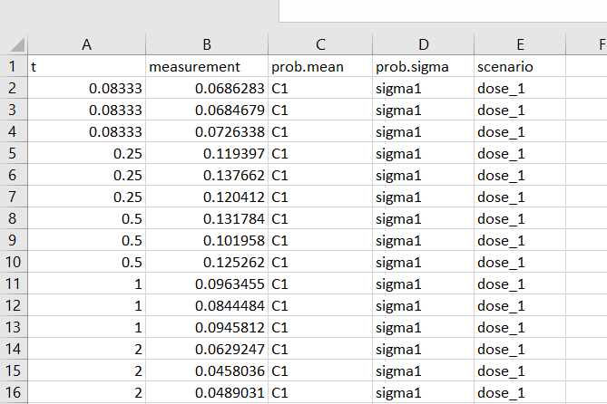

# Fitting. Measurements

### Under development! Be sure you have the latest __HetaSimulator.jl__ version.

[`fit`](@ref) method can be used to estimate model parameters based on experimental data.
Typically the method is applied to the whole `Platform` but it can also be used with the selected `Scenario`s.

Be sure you have the latest __HetaSimulator.jl__ version.

```julia
] # switch to Pkg mode
add HetaSimulator
```

## Working example

This example uses the `heta` model, which can be downloaded here: [index.heta](./fit-files/index.heta)

```heta
// Compartments
Vol0 @Compartment .= 1;
Vol1 @Compartment .= 6.3;
Vol2 @Compartment .= 10.6;

// Species
A0 @Species {compartment: Vol0, isAmount: true, output: true} .= 0;
C1 @Species {compartment: Vol1, output: true} .= 0;
C2 @Species {compartment: Vol2, output: true} .= 0;

// Reactions
v_abs @Reaction {actors: A0 = C1} := kabs * A0;
v_el @Reaction {actors: C1 =} := Vol1 * (kel * C1); // Vol1 * (kmax * C1 / (Km + C1));
v_distr @Reaction {actors: C1 = C2} := Q * (C1 - C2);

// Parameters
dose @Const = 20;
kabs @Const = 20;
kel @Const = 0.5;
Q @Const = 1.0;
// kmax @Const = 3e3;
// Km @Const = 9e3;

// single dose event
sw1 @TimeSwitcher {start: 0};
A0 [sw1]= dose;

// multiple dose event, default off
sw2 @TimeSwitcher {start: 0, period: 24, active: false};
A0 [sw2]= dose;

// parameters for fitting
sigma1 @Const = 0.1;
sigma2 @Const = 0.1;
sigma3 @Const = 0.1;
```

Download the file or create  __index.heta__ with VSCode in the working directory.

Load the platform into the Julia environment. You should provide the path to the modeling platform as the first argument to `load_platform`.
We will use the same working directory where the `index.heta` file is located.

```julia
using HetaSimulator, Plots

p = load_platform(".")
```

The following table describes 4 scenarios.


The file can be downloaded here: [scenarios.csv](./fit-files/scenarios.csv)

Load scenarios into the platform.

```julia
scn_df = read_scenarios("./scenarios.csv")
add_scenarios!(p, scn_df)
```

## Load measurements

Experimental data can be used for both visualization and parameters estimation.
To read more about measurements tables format see the [documentation](@ref measurement).



The measurements file can be downloaded here: [measurements.csv](./fit-files/measurements.csv). The dataset includes `C1` observable measurements with unknown variance.

The measurement table can be loaded into the `Platform` using `read_measurements` and `add_measurements!` functions.

```julia
measurements_df = read_measurements("./measurements.csv")
```

```
90×5 DataFrame
 Row │ t         measurement  prob.mean  prob.sigma  scenario 
     │ Float64   Float64      String     String      Symbol   
─────┼────────────────────────────────────────────────────────
   1 │  0.08333    0.0686283  C1         sigma1      dose_1
   2 │  0.08333    0.0684679  C1         sigma1      dose_1
  ⋮  │    ⋮           ⋮           ⋮          ⋮          ⋮
  89 │ 24.0        1.036      C1         sigma3      dose_100
  90 │ 24.0        0.724612   C1         sigma3      dose_100
                                               86 rows omitted
```

```julia
add_measurements!(p, measurements_df)

# display platform content
p
```

```
Platform with 1 model(s), 4 scenario(s), 90 measurement(s)
   Models: nameless
   Scenarios: dose_1, dose_10, dose_100, multiple_15
```

We can plot simulation results together with measured values.

```julia
# simulate all
res = sim(p)
```

```
4-element Vector{Pair{Symbol, SimResult}}
    :dose_1 => 80x3 SimResult with status :Success.
    :dose_10 => 100x3 SimResult with status :Success.
    :dose_100 => 124x3 SimResult with status :Success.
    :multiple_15 => 668x3 SimResult with status :Success.
```

```julia
# plot all default
plot(res)
```


One can use the additional `yscale`, `ylim` and other `Plots` keyword arguments to change how the results are displayed. 

```julia
# plot C1, C2 in log scale
plot(res, vars=[:C1,:C2], yscale=:log10, ylim=(1e-3, 1e3))
```


## Fitting

Before we run the optimization procedure we set the initial (nominal) values for the parameters selected for fitting.

`sigma1`, `sigma2`, `sigma3` parameters are not included in the model code. They describe the variability of measurement error for the scenarios: `dose_1`, `dose_10` and `dose_100`.

```julia
# fitted parameters
to_fit = [
    :kabs => 8.0,
    :Q => 4.0,
    :kel => 2.2,
    :sigma1 => 0.1,
    :sigma2 => 0.1,
    :sigma3 => 0.1,
]
res_optim = fit(p, to_fit) # default fitting
```

```
┌ Warning: Scenario ":multiple_15" has no measurements. It will be excluded from fitting.
└ @ HetaSimulator y:\HetaSimulator.jl\src\fit.jl:77
FitResult with status :XTOL_REACHED
   Status: XTOL_REACHED
   Optimal values: [:kabs => 18.868605026704916, :Q => 4.043662480774219, :kel => 0.17104243648378176, :sigma1 => 0.020347955494158528, :sigma2 => 0.31561050699802246, :sigma3 => 0.5716026958426483]
   OF value: 140.96503722971997
   OF count: 8612
```

The scenario `multiple_15` does not include any measurement. That's why we see the warning message here. This is not an error.


The optimal value of the parameters can be obtained with `optim` method applied to `FitResult`.
```julia
# optimal parameters
optim(res_optim)
```

```
 6-element Vector{Pair{Symbol, Float64}}:
   :kabs => 18.868605026704916
      :Q => 4.043662480774219
    :kel => 0.17104243648378176
 :sigma1 => 0.020347955494158528
 :sigma2 => 0.31561050699802246
 :sigma3 => 0.5716026958426483
```

To display the simulations with the updated parameters values we can use `parameters` argument in `sim`.

```julia
# check fitting quality 
res = sim(p, parameters = optim(res_optim))
plot(res, yscale=:log10, vars=[:C1,:C2], ylims=(1e-3,1e2))
```


## Fitting with parameters table

The parameters setup that is used in `fit` can also be loaded from tabular format.
The description of tabular format can be found in [documentation](@ref parameters).

For example we will use the following table. It can be downloaded here: [parameters.csv](./fit-files/parameters.csv)


The table can be loaded with `read_parameters` method.

```julia
# read parameters from table
params_df = read_parameters("./parameters.csv")
```

```
6×6 DataFrame
 Row │ parameter  scale   lower    upper    nominal  estimate 
     │ Symbol     Symbol  Float64  Float64  Float64  Bool     
─────┼────────────────────────────────────────────────────────
   1 │ kabs       lin         1.0    100.0      8.0      true
   2 │ kel        log         0.0     60.0      2.2      true
   3 │ Q          log10       1.0     80.0      4.0      true
   4 │ sigma1     lin         0.0     10.0      0.1      true
   5 │ sigma2     lin         0.0     10.0      0.1      true
   6 │ sigma3     lin         0.0     10.0      0.1      true
```

As before we can use this as a setup `DataFrame` for parameters estimation.

```julia
res_optim = fit(p, params_df)
```

```
┌ Warning: Scenario ":multiple_15" has no measurements. It will be excluded from fitting.
└ @ HetaSimulator 
FitResult with status :FTOL_REACHED
   Status: FTOL_REACHED
   Optimal values: [:kabs => 8.669590504032879, :kel => 0.2299120380231296, :Q => 3.386457652767808, :sigma1 => 0.010105725225267037, :sigma2 => 0.09951673713071268, :sigma3 => 0.6024808584834973]
   OF value: -101.7645013649068
   OF count: 417
```

## Additional optimization-specific options

Internally `HetaSimulator` uses `NLopt` library. One can choose the optimization algorithm as well as additional options.

Read more about NLopt algorithms choice: <https://nlopt.readthedocs.io/en/latest/NLopt_Algorithms/>
 
```julia
res_optim = fit(
    p, 
    params_df, 
    fit_alg = :LN_SBPLX, 
    ftol_abs = 1e-5, 
    ftol_rel = 0, 
    maxeval = 10^6
)
optim(res_optim)
```

There are several optimization related arguments, which are available for a user. 
To learn more read about [`fit`](@ref) method in API documentation.

- `fit_alg` : fitting algorithm. Default is `:LN_NELDERMEAD`
- `ftol_abs` : absolute tolerance on function value. Default is `0.0`
- `ftol_rel` : relative tolerance on function value. Default is `1e-4`
- `xtol_rel` : relative tolerance on optimization parameters. Default is `0.0`
- `xtol_rel` : absolute tolerance on optimization parameters. Default is `0.0`
- `maxeval` : maximum number of function evaluations. Default is `1e4`
- `maxtime` : maximum optimization time (in seconds). Default is `0`
