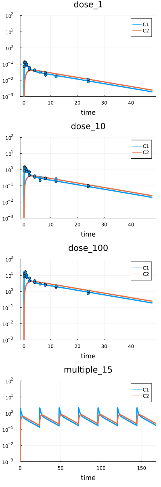

# Fitting. Measurements

The [`fit`](@ref) can be used to evaluate a model parameters based on experimental data.
Typically the method is applied for the whole platform but can be also used for selected `Scenario`s.

_Before start be sure you have the latest __HetaSimulator.jl__ version. If you don't have it reinstall using the Julia environment.

```julia
] # switch to Pkg mode
add https://github.com/hetalang/HetaSimulator.jl
```

## Working example

This lesson uses the following model code.

File can be downloaded here: [index.heta](./fit-files/index.heta)

```heta
// Compartments
Vol0 @Compartment .= 1;
Vol1 @Compartment .= 6.3;
Vol2 @Compartment .= 10.6;

// Species
A0 @Species {compartment: Vol0, isAmount: true, output: true} .= 0;
C1 @Species {compartment: Vol1, output: true} .= 0;
C2 @Species {compartment: Vol2, output: true} .= 0;

// Reactions
v_abs @Reaction {actors: A0 = C1} := kabs * A0;
v_el @Reaction {actors: C1 =} := Vol1 * (kel * C1); // Vol1 * (kmax * C1 / (Km + C1));
v_distr @Reaction {actors: C1 = C2} := Q * (C1 - C2);

// Parameters
dose @Const = 20;
kabs @Const = 20;
kel @Const = 0.5;
Q @Const = 1.0;
// kmax @Const = 3e3;
// Km @Const = 9e3;

// single dose event
sw1 @TimeSwitcher {start: 0};
A0 [sw1]= dose;

// multiple dose event, default off
sw2 @TimeSwitcher {start: 0, period: 24, active: false};
A0 [sw2]= dose;

// parameters for fitting
sigma1 @Const = 0.1;
sigma2 @Const = 0.1;
sigma3 @Const = 0.1;
```

Download the file or create  __index.heta__ with VSCode in the working directory.

Load the platform into the Julia environment. You should clarify the path to the modeling platform as the first argument.
Today we will use the same working directory where the index.heta file is located.

```julia
using HetaSimulator, Plots

p = load_platform(".")
```

The following table describing 4 scenarios will be used.


File can be downloaded here: [scenarios.csv](./fit-files/scenarios.csv)

Load scenarios into the platform.

```julia
scn_df = read_scenarios("./scenarios.csv")
add_scenarios!(p, scn_df)
```

## Load measurements

Experimental data can be used for both: visualizing and parameter estimation.
To read more about measurements tables format see the [documentation](../table-formats/measurement).


File can be downloaded here: [measurements.csv](./fit-files/measurements.csv). The presented dataset includes the measurement of `C1` with unknown variance equal for a particular condition.

The measurement table can be loaded into platform using `read_measurements` and `add_measurements!` functions.

```julia
measurements_df = read_measurements("./measurements.csv")
```

```
90×5 DataFrame
 Row │ t         measurement  prob.mean  prob.sigma  scenario 
     │ Float64   Float64      String     String      Symbol   
─────┼────────────────────────────────────────────────────────
   1 │  0.08333    0.0686283  C1         sigma1      dose_1
   2 │  0.08333    0.0684679  C1         sigma1      dose_1
  ⋮  │    ⋮           ⋮           ⋮          ⋮          ⋮
  89 │ 24.0        1.036      C1         sigma3      dose_100
  90 │ 24.0        0.724612   C1         sigma3      dose_100
                                               86 rows omitted
```

```julia
add_measurements!(p, measurements_df)

# display platform content
p
```

```
Platform with 1 model(s), 4 scenario(s), 90 measurement(s)
   Models: nameless
   Scenarios: dose_1, dose_10, dose_100, multiple_15
```

If we run the simulations and then plot them we see the simulation results together with measured values.

```julia
# simulate all
res = sim(p)

# plot all default
plot(res)
```


To display in more convenient way one can use the additional `yscale` and `ylim` arguments. 

```julia
# plot C1, C2 in log scale
plot(res, yscale=:log10, ylim=(1e-3, 1e3))
```


## Fitting

Before we run the optimization procedure we should select the parameters to optimize with the starting values.

`sigma1`, `sigma2`, `sigma3` are not included in the main model code. They describe just the variability of error for the scenarios: `dose_1`, `dose_10` and `dose_100`.

```julia
# fitted parameters
to_fit = [
    :kabs => 8.0,
    :Q => 4.0,
    :kel => 2.2,
    :sigma1 => 0.1,
    :sigma2 => 0.1,
    :sigma3 => 0.1,
]
res_optim = fit(p, to_fit) # default fitting
```

```
┌ Warning: Scenario ":multiple_15" has no measurements. It will be excluded from fitting.
└ @ HetaSimulator y:\HetaSimulator.jl\src\fit.jl:74
FitResults with status :FTOL_REACHED
   Status: FTOL_REACHED
   Optimal values: [:kabs => 9.664612290142436, :Q => 3.182280353785782, :kel => 0.20333675237278281, :sigma1 => 0.20073592014870978, :sigma2 => 0.15748031874469834, :sigma3 => 0.11672689231044918]
   Objective function value: 4164.493819852298
   Objective function evaluations count: 134
```

The scenario `multiple_15` does not include any measurement. That's why we see the warning message here. This is not an error.


The optimal value of the parameters can be obtained with `optim` method applied for `FitResults`.
```julia
# optimal parameters
optim(res_optim)
```

```
6-element Vector{Pair{Symbol, Float64}}:
   :kabs => 9.664612290142436
      :Q => 3.182280353785782
    :kel => 0.20333675237278281
 :sigma1 => 0.20073592014870978
 :sigma2 => 0.15748031874469834
 :sigma3 => 0.11672689231044918
```

To display the simulations with updated parameters values we can use `parameters_upd` argument in `sim`.

```julia
# check fitting quality 
res = sim(p, parameters_upd = optim(res_optim))
plot(res, yscale=:log10, vars=[:C1,:C2], ylims=(1e-3,1e2))
```



## Fitting with parameters table

The parameters set that is used for `fit` can also be taken from tables.
The description of table format can be found in [documentation](..table-formats/parameters/).

For example we will use the following table.


File can be downloaded here: [parameters.csv](./fit-files/parameters.csv)
The table can be loaded with `read_parameters` method.

```julia
# read parameters from table
params_df = read_parameters("./parameters.csv")
```

```
6×6 DataFrame
 Row │ parameter  scale   lower    upper    nominal  estimate 
     │ Symbol     Symbol  Float64  Float64  Float64  Bool     
─────┼────────────────────────────────────────────────────────
   1 │ kabs       lin         1.0    100.0      8.0      true
   2 │ kel        log         0.0     60.0      2.2      true
   3 │ Q          log10       1.0     80.0      4.0      true
   4 │ sigma1     lin         0.0     10.0      0.1      true
   5 │ sigma2     lin         0.0     10.0      0.1      true
   6 │ sigma3     lin         0.0     10.0      0.1      true
```

As previously we can use this `DataFrame` for optimization.

```julia
res_optim = fit(p, params_df)
```

```
┌ Warning: Scenario ":multiple_15" has no measurements. It will be excluded from fitting.
└ @ HetaSimulator y:\HetaSimulator.jl\src\fit.jl:74
FitResults with status :FTOL_REACHED
   Status: FTOL_REACHED
   Optimal values: [:kabs => 9.696004253888853, :kel => 0.20422994254743634, :Q => 3.1651123659949176, :sigma1 => 0.15675092258640785, :sigma2 => 0.10972117348555543, :sigma3 => 0.0957743148928216]
   Objective function value: 4164.577650364314
   Objective function evaluations count: 108
```

## Additional optimization-specific options

Internally `HetaSimulator` uses NLopt library. We can choose the optimization algorithm as well as additional options.

Read more here: <https://nlopt.readthedocs.io/en/latest/NLopt_Algorithms/>
 
```julia
res_optim = fit(
    p, 
    params_df, 
    fit_alg = :LN_SBPLX, 
    ftol_abs = 1e-5, 
    ftol_rel = 0, 
    maxeval = 10^6
)
optim(res_optim)
```

There are several options which are available for a user. 
To know more read about [`fit`](@ref) in API documentation.

- fit_alg : fitting algorithm. Default is :LN_NELDERMEAD
- ftol_abs : absolute tolerance on function value. Default is 0.0
- ftol_rel : relative tolerance on function value. Default is 1e-4
- xtol_rel : relative tolerance on optimization parameters. Default is 0.0
- xtol_rel : absolute tolerance on optimization parameters. Default is 0.0
- maxeval : maximum number of function evaluations. Default is 1e4
- maxtime : maximum optimization time (in seconds). Default is 0
