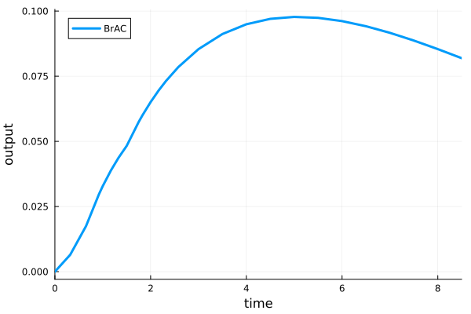
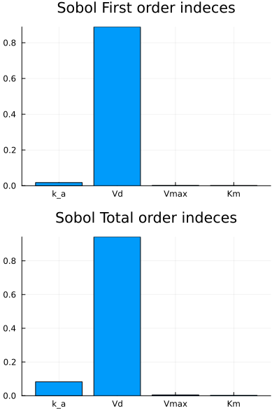
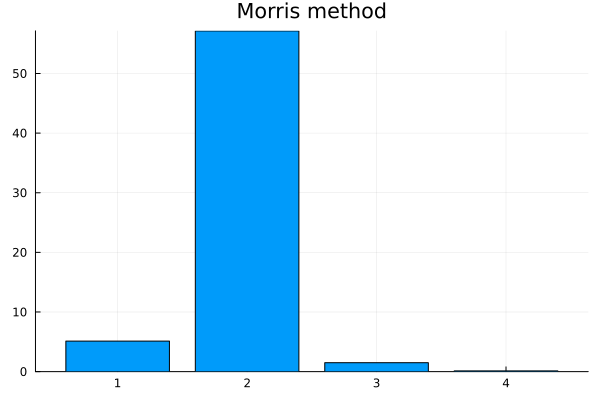

# Global Sensitivity Analysis

This tutorial describes methods of **Global Sensitivity Analysis (GSA)** by using **HetaSimulator** together with **GlobalSensitivity** package. The content is based on [GlobalSensitivity tutorial](https://docs.sciml.ai/GlobalSensitivity/stable/tutorials/juliacon21/). Current version of the tutorial is based on **HetaSimulator v0.6.2** and **GlobalSensitivity v2.7.0**

In order to run GSA we need to install **GlobalSensitivity** package in addition to **HetaSimulator** and **Plots**.
We will also use **QuasiMonteCarlo** package for sampling.

```julia
julia> ]
(gsa) pkg> add GlobalSensitivity QuasiMonteCarlo
```

## Working example

All GSA methods are illustrated by one-compartment [Ethanol PK Model](https://github.com/insysbio/alco). 
Download the following files to your working directory:
```
wget https://raw.githubusercontent.com/insysbio/alco/main/src/index.heta
wget https://raw.githubusercontent.com/insysbio/alco/main/src/mod1.heta
wget https://raw.githubusercontent.com/insysbio/alco/main/src/mod2.heta
wget https://raw.githubusercontent.com/insysbio/alco/main/src/mod3.heta
wget https://raw.githubusercontent.com/insysbio/alco/main/src/qsp-units.heta
wget https://raw.githubusercontent.com/insysbio/alco/main/data-mumenthaler-2000/scenarios.csv
```

Load the platform into the Julia environment. You should provide the path to the `index.heta` file as the first argument to `load_platform`.
We will use the same working directory where the `index.heta` file is located.

```julia
using HetaSimulator, GlobalSensitivity, Plots

p = load_platform(".")

scen = read_scenarios("scenarios.csv")
add_scenarios!(p, scen)
```

According to Model1 scenario we will study the sensitivity of *BrAC* observable (breath alcohol concentration) to four parameters *(:k_a, :Vd, :Vmax, :Km)*.

```julia
scn1 = scenarios(p)[:scn1]
s = sim(scn1)
plot(s, vars=[:BrAC])
```



To run GSA we need to define a function which takes in parameter values and outputs an observable. The observable can be any function of timeseries (e.g. mean, maximum, minimum, AUC, value at a certain timepoint). We can also define vector output to study sensitivity of different observables or an observed variable at different timepoints.

Let's have a look at some examples of such functions. 

```julia
pnames = [:k_a, :Vd, :Vmax, :Km]
nump = length(pnames)

# Concentration value at t=8 hours
function C8hours_func(params)
  sol = sim(scn1; parameters= pnames .=> params)
  return sol(8.0,:BrAC)
end

# Concentration values at two timepoints t=4,8 hours
function C8hours_func(params)
  sol = sim(scn1; parameters= pnames .=> params)
  return sol.([4.0, 8.0],:BrAC)
end
```
In this tutorial we will observe maximum alcohol concentration in the compartment.
```julia
function Cmax_func(params)
  sol = sim(scn1; parameters= pnames .=> params)
  brac = sol.(times(sol),:BrAC)
  return maximum(brac)
end
```


Now we define parameters bounds based mean/sd values reported in the original paper [Ethanol Pharmacokinetics in White Women](https://doi.org/10.1111/j.1530-0277.2000.tb02103.x). Parameters bound imply Uniform distribution. Usage of other distributions (Normal, LogNormal, etc) for parameters sampling will be demonstrated later in the tutorial.

```julia
bounds = [[0.01, 0.5], [0.01, 1.], [0.01, 0.5], [0.01, 5.0]]
```


## GSA Methods

### Regression/Correlation coefficients method

[RegressionGSA method details](https://docs.sciml.ai/GlobalSensitivity/stable/methods/regression/)

The least computationally demanding method to estimate global sensitivities is to compute correlation/regression coefficients. This method is based on the assumption, that the output can be approximated by a linear model of parameters (e.g. `BrACmax = a1*k_a + a2∗Vd + a3∗Vmax + a4∗Km`). This assumption is reasonable if **the output is monotonic in each of the input parameters**, otherwise the reported coefficients can be missleading. 

The number of samples required by the method should be larger than 2^P (where P is the number of input parameters). 2^P is the bare minimum and a reasonable number of samples for a model of four-five parameters is 1000-5000.

Usually **Standard Regression Coefficients (SRC)** and **Partial Correlation Coefficients (PCC)** are considered.

```julia
nsamples = 1000
reg_sens = GlobalSensitivity.gsa(Cmax_func, RegressionGSA(true), bounds, samples = nsamples)

p = plot(layout=(2,1), size=(400,600))
heatmap!(p[1],
    reg_sens.partial_correlation, fc =cgrad([:blue, :orange]),
    yticks=false, xticks = (1:nump, String.(pnames)),
    title = "Partial correlation")

heatmap!(p[2],
    reg_sens.standard_regression,fc =cgrad([:blue, :orange]),
    yticks=false, xticks = (1:nump, String.(pnames)),
    title = "Standard correlation")
p
```


**(Note!)** Regression-based GSA can also be applied to the results of multiple simulations provided to `gsa()` function as `Matrices`. See [GlobalSensitivity docs](https://docs.sciml.ai/GlobalSensitivity/stable/methods/regression/). This allows us generate parameters in advance from pre-defined Distributions.

```julia
# Matrix of input parameters
X = zeros(length(pnames), nsamples)
X[1,:] .= rand(LogNormal(-3.08, 0.77), nsamples) # k_a
X[2,:] .= rand(Uniform(0.01, 1.), nsamples) # Vd
X[3,:] .= rand(Uniform(0.01, 0.5), nsamples) # Vmax
X[4,:] .= rand(LogNormal(0.46, 0.49), nsamples) # Km

# output max concentration values
Y = [Cmax_func(X[:, i]) for i in 1:size(X,2)]'

reg_sens = GlobalSensitivity.gsa(X, Y, RegressionGSA(true))
```

### Sobol (and eFAST) method

[Sobol method details](https://docs.sciml.ai/GlobalSensitivity/stable/methods/sobol/)

Sobol method is the GSA method of variance decomposition based on mathematical result by I.M. Sobol. Variance of the output is decomposed into contributions from each parameter and their interactions. Two indices are used to measure these contributions. The contribution of each parameter is represented by **first-order index** and the contribution of the parameter together with all its interactions with other parameters is represented by **total-order index**. 

The requirement for the number of samples is the same as for Correlatin/Regression coefficients method: **The number of samples required by the method should be larger than 2^P (where P is the number of input parameters).**

```julia
nsamples = 1000
sobol_sens1 = GlobalSensitivity.gsa(Cmax_func, Sobol(), bounds, samples = nsamples)

p = plot(layout=(2,1), size=(400,600), xticks = (1:nump, String.(pnames)))
bar!(p[1], 1:nump, sobol_sens1.S1, title = "Sobol First order indeces", label=false)
bar!(p[2], 1:nump, sobol_sens1.ST, title = "Sobol Total order indeces", label=false)
p
```


**(Note 1 !)** It is recommended to use low-discrepancy sequence instead of a pure Monte-Carlo to effectively sample the search space . One can choose `SobolSample()`, `LatinHypercubeSample()`, `HaltonSample()` or other quasi-Monte Carlo samplers from `QuasiMonteCarlo` package. 

```julia
using QuasiMonteCarlo

lb = [b[1] for b in bounds]
ub = [b[2] for b in bounds]
sampler = SobolSample()
A,B = QuasiMonteCarlo.generate_design_matrices(nsamples,lb,ub,sampler)

sobol_sens2 = GlobalSensitivity.gsa(Cmax_func, Sobol(), A, B)
```

**(Note 2 !)** To ensure the convergence of Sobol indices and choose reasonable sample size it is useful to set different sample sizes and monitor (plot) how the indices' values stabilize with the increase of sample size. 

**(Note 3 !)** As of GlobalSensitivity@v2.7.0 `Sobol()` implementation supports  Uniform input ranges and not parameters' distributions. If you prefer to input parameters' distributions you can choose `eFAST()`, which is based on `Sobol()` method. Please refer to the [eFAST docs](https://docs.sciml.ai/GlobalSensitivity/stable/methods/efast/) for detailed example.

### Morris method (Elementary effects method)

[Morris method details](https://docs.sciml.ai/GlobalSensitivity/stable/methods/morris/)

Morris method estimates parameters' contribution to the output be computing individual "elementary effects" (EE), which are local sensitivities at different points in the parameters space. The method runs multiple trajectories through the grid of points in parameter space, computes EEs and outputs mean and std of EE per parameter. The sensitivities are calculated per parameter, so the method doesn't take into account interactions between parameters. Morris method doesn't have a strong mathematical foundation (as Sobol method). Due to its simplicity, it is commonly used as a pre-scan method with all the input parameters of interest. Parameters identified as noninfluential can be then fixed to run computationally demanding but more reliable variance-based methods (`Sobol()`, `eFAST()`)

The requirement for the number of samples is the same as for Correlatin/Regression coefficients method: **The number of samples required by the method should be larger than 2^P (where P is the number of input parameters).**

The number of estimated points in the parameter space is controlled by `total_num_trajectory` and `num_trajectory` arguments. See [Morris method docs](https://docs.sciml.ai/GlobalSensitivity/stable/methods/morris/) for details. 
```julia
morris_sens = GlobalSensitivity.gsa(Cmax_func, Morris(total_num_trajectory=5000,num_trajectory=600), bounds)

bar(1:nump, morris_sens.means_star[1,:], title = "Morris method", label=false)
```


**(Note 1 !)** Morris method also outputs std of EE per parameter: `morris_sens.variances`. High std reported by Morris method can be a marker of parameters interaction or high nonlinearity between the parameters and the output. 

**(Note 2 !)** As in `Sobol()` method it useful to set different number of trajectories and monitor how the mean values stabilize with the increase of sample size. 

**(Note 3 !)** As of GlobalSensitivity@v2.7.0 `Morris()` implementation doesn't support `generate_design_matrices` interface (see Sobol method notes), so only default sampling scheme (Monte-Carlo) can be used.

## Parallel setup

It is natural to speed-up GSA methods (e.g. Sobol method) by running simulations in parallel. To do so we need to rewrite `Cmax_func` and use `batch` keyword argument in the `gsa()` function.

```julia
function Cmax_batch_func(params_batch)
    batch_size = size(params_batch,2)
    sol = mc(scn1, pnames .=> [params_batch[i,:] for i in eachindex(pnames)], batch_size; parallel_type=EnsembleDistributed())
    
    out = zeros(batch_size)
    for i in eachindex(out)
        brac = sol[i].(times(sol[i]),:BrAC)
        out[i] = maximum(brac)
    end
    return out
  end

  sobol_sens = GlobalSensitivity.gsa(Cmax_batch_func, Sobol(), A, B, batch=true)
```
