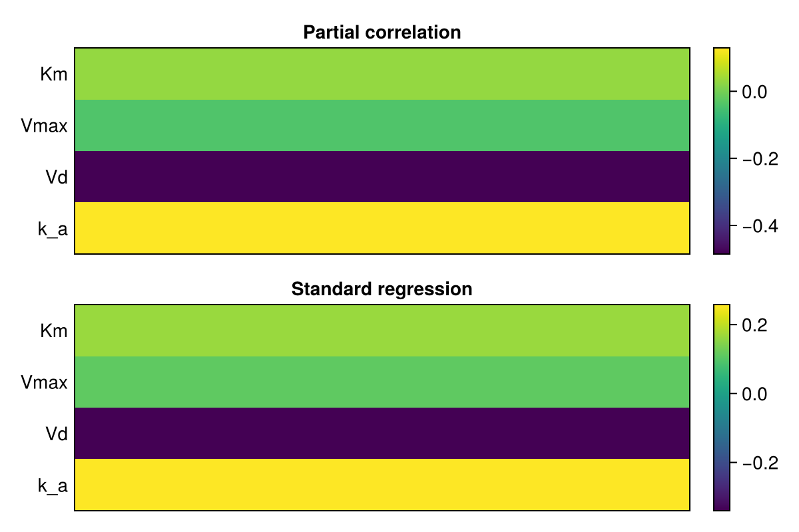
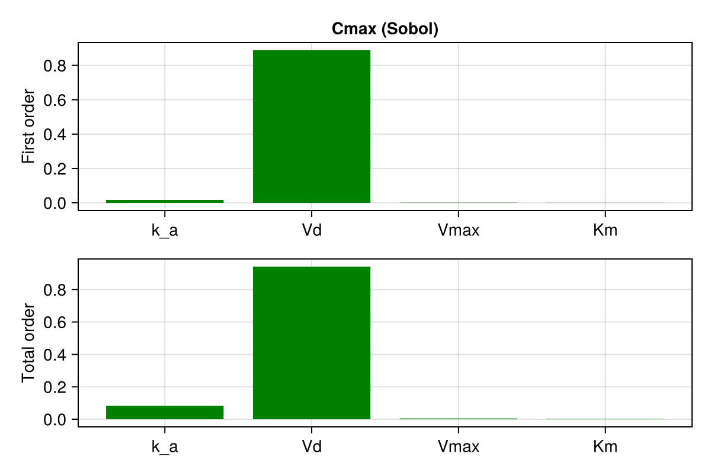

# Global Sensitivity Analysis

This tutorial describes methods of **Global Sensitivity Analysis (GSA)** by using **HetaSimulator** together with **GlobalSensitivity** package. The content is based on [GlobalSensitivity tutorial](https://docs.sciml.ai/GlobalSensitivity/stable/tutorials/juliacon21/).

In order to run GSA we need to install **GlobalSensitivity** package in addition to **HetaSimulator** and **Plots**.
We will also use **QuasiMonteCarlo** package for sampling and **CairoMakie** for plots.

```julia
julia> ]
(gsa) pkg> add GlobalSensitivity QuasiMonteCarlo CairoMakie
```

## Working example

All GSA methods are illustrated by one-compartment [Ethanol PK Model](https://github.com/insysbio/alco). 
Download the content of */alco/src* and *alco/data-mumenthaler-2000/scenarios.csv* to your working directory.

Load the platform into the Julia environment. You should provide the path to the modeling platform as the first argument to `load_platform`.
We will use the same working directory where the `index.heta` file is located.

```julia
using HetaSimulator, GlobalSensitivity, CairoMakie, Plots

p = load_platform(".")

scen = read_scenarios("scenarios.csv")
add_scenarios!(p, scen)
```

According to Model1 scenario we will study the sensitivity of *BrAC* observable (breath alcohol concentration) to four parameters *(:k_a, :Vd, :Vmax, :Km)*.

```julia
scn1 = scenarios(p)[:scn1]
s = sim(scn1)
Plots.plot(s, vars=[:BrAC])
```


To run GSA we need to define a function which takes in parameter values and outputs an observable. The observable can be any function of timeseries (e.g. mean, maximum, minimum, AUC, value at a certain timepoint). We can also define vector output to study sensitivity of different observables.
Here we are interested in maximum alcohol concentration in the compartment.

```julia
pnames = [:k_a, :Vd, :Vmax, :Km]

function Cmax_func(params)
  sol = sim(scn1; parameters= pnames .=> params)
  brac = sol.(times(sol),:BrAC)
  return maximum(brac)
end
```

Now we define parameters bounds based mean/sd values reported in the original paper [Ethanol Pharmacokinetics in White Women](https://doi.org/10.1111/j.1530-0277.2000.tb02103.x). (<span style="color:red">**TODO**</span>: Note about distributions)

```julia
bounds = [[0.01, 0.5], [0.01, 1.], [0.01, 0.5], [0.01, 5.0]]
```

## GSA Methods

### Regression/Correlation coefficients

The least computationally demanding method to estimate global sensitivities is to compute correlation/regression coefficients. This method is based on the assumption, that the output can be approximated by a linear model of parameters (e.g. `BrACmax = a1*k_a + a2∗Vd + a3∗Vmax + a4∗Km`). This assumption is reasonable if **the output is monotonic in each of the input parameters**, otherwise the reported coefficients can be missleading. 

The number of samples required by the method should be larger than 2^P (where P is the number of input parameters). 2^P is the bare minimum and a reasonable number of samples for a model of four-five parameters is 1000-5000.

Usually **Standard Regression Coefficients (SRC)** and **Partial Correlation Coefficients (PCC)** are considered.

```julia
nsamples = 1000
reg_sens = GlobalSensitivity.gsa(Cmax_func, RegressionGSA(true), bounds, samples = nsamples)

fig = Figure(resolution = (600, 400))
ax, hm = CairoMakie.heatmap(fig[1, 1],
    reg_sens.partial_correlation,
    axis = (xticksvisible = false, yticksvisible = false, yticks = ([1,2,3,4], String.(pnames)),
        xticklabelsvisible = false, title = "Partial correlation"))
Colorbar(fig[1, 2], hm)
ax, hm = CairoMakie.heatmap(fig[2, 1],
    reg_sens.standard_regression,
    axis = (xticksvisible = false, yticksvisible = false, yticks = ([1,2,3,4], String.(pnames)),
        xticklabelsvisible = false, title = "Standard regression"))
Colorbar(fig[2, 2], hm)
fig
```


**(Note!)** Regression-based GSA can also be used with the results of multiple simulations provided to `gsa()` function as DataFrames. See [GlobalSensitivity docs](https://docs.sciml.ai/GlobalSensitivity/stable/methods/regression/).

### Sobol (and eFAST) method

Sobol method is the GSA method of variance decomposition based on mathematical result by I.M. Sobol. Variance of the output is decomposed into contributions from each parameter and their interactions. Two indices are used to measure these contributions. The contribution of each parameter is represented by **first-order index** and the contribution of the parameter together with all its interactions with other parameters is represented by **total-order index**. 

The requirement for the number of samples is the same as for Correlatin/Regression coefficients method: The number of samples required by the method should be larger than 2^P (where P is the number of input parameters).

```julia
nsamples = 1000
sobol_sens1 = GlobalSensitivity.gsa(Cmax_func, Sobol(), bounds, samples = nsamples)

fig = Figure(resolution = (600, 400))
barplot(fig[1, 1],
    [1, 2, 3, 4],
    sobol_sens1.S1,
    color = :green,
    axis = (xticks = (1:4, String.(pnames)),
        title = "Cmax (Sobol)", ylabel = "First order"))
barplot(fig[2, 1], [1, 2, 3, 4], sobol_sens1.ST, color = :green,
    axis = (xticks = (1:4, String.(pnames)), ylabel = "Total order"))
fig
```


**(Note 1 !)** It is recommended to use low-discrepancy sequence instead of a pure Monte-Carlo to effectively sample the search space . One can choose `SobolSample()`, `LatinHypercubeSample()`, `HaltonSample()` or other quasi-Monte Carlo samplers from `QuasiMonteCarlo` package. 

```julia
using QuasiMonteCarlo

lb = [b[1] for b in bounds]
ub = [b[2] for b in bounds]
sampler = SobolSample()
A,B = QuasiMonteCarlo.generate_design_matrices(nsamples,lb,ub,sampler)

sobol_sens2 = GlobalSensitivity.gsa(Cmax_func, Sobol(), A, B)
```

**(Note 2 !)** To monitor the convergence of Sobol indices it is usefull to set different sample sizes and visualize how the indices' values stabilize with the increase of sample size. 

<span style="color:red">**TODO**</span>

```julia

```

**(Note 3 !)** It is natural to speed-up GSA (e.g. Sobol method) by running simulations in parallel. To do so we need to rewrite `Cmax_func` and use `batch` keyword argument in the `gsa()` function.

```julia
function Cmax_batch_func(params_batch)
    batch_size = size(params_batch,2)
    sol = mc(scn1, pnames .=> [params_batch[i,:] for i in eachindex(pnames)], batch_size; parallel_type=EnsembleDistributed())
    
    out = zeros(batch_size)
    for i in eachindex(out)
        brac = sol[i].(times(sol[i]),:BrAC)
        out[i] = maximum(brac)
    end
    return out
  end

  sobol_sens = GlobalSensitivity.gsa(Cmax_batch_func, Sobol(), A, B, batch=true)
```