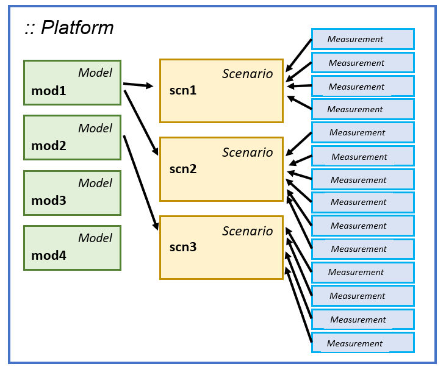

# Introduction

HetaSimulator was designed as a modeling environment for Quantitative Systems Pharmacology (QSP) and Systems Biology (SB) projects.
The endpoint users are not experienced Julia users but rather researchers having biological, biophisical and bioinformatical background.
We avoided complex user interfaces and limit the number of different methods for the base modeling workflow.

The approach implies the "modeling platform" term that means everything helpful for modeling: models structure, variables, parameters, scenarios and experimental dataset. From the practical point of view "modeling platform" is the same as project files.
The representation of modeling platform in the HetaSimulator package is object of the [`Platform`](@ref) type.
This object stores `Model`s, `Scenario`s and `Measurement`s.

## Architecture

[`Model`](@ref) type represents one concrete namespace imported from [Heta-compiler](https://hetalang.github.io/#/heta-compiler/). It stores information about ODE system, initialization of initial values, events as well as default values of constants. The HetaSimulator approach imply multi-model usage so simulations and optimizations can be done for several models simultaneously without specific preparations.

[`Scenario`](@ref) type stores additional setting for running ODE solution and tasks. For example the same model can be run with or without some events, or differ by some specific constant values like doses and others, or has some specific output variables (observables). Each `Scenario` is associated with a specific `Model`. Each model may be referenced by any number of scenarios.

Additionally `Scenario` instance is a container for the `Measurement` objects which describe experimental datasets. They can be used for identification of model parameters or some specific tasks like identifiability analysis and visualization. 



There is no need to create more than one `Platform` object because it can store any number of `Model`s and `Scenario`s. The advisable workflow is (1) to create one `Platform` using [`load_platform`](@ref) method, (2) update it by `Scenario`s and `Measurement`s using formatted CSV tables and (3) apply different methods depending on your goals.

There are base methods that can be applied for a platform object, for example `sim`, `mc` and `fit`.
These methods can be applied for a particular `Scenario` or for the whole platform (all scenarios in platform).
The last approach is preferable.

## HetaSimulator vs Heta-compiler

Both [Heta compiler](https://hetalang.github.io/#/heta-compiler/) and HetaSimulator.jl are part of the __Heta project__ initiative.
They uses the same standards of model and notation and can be applied in the same projects.
Furthermore currently the `heta-simulator` JS code is used internally in HetaSimulator.

When a user installs HetaSimulator in Julia the most appropriate version of __heta compiler__ will be installed as well.

If you need to reinstall heta compiler it can be done with the following code.

```julia
heta_update()
```

To install a specific version of the compiler you can use 

```julia
heta_update("0.6.14") # for heta-compiler v0.6.14
```
