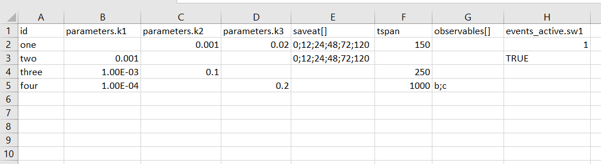

# Monte-Carlo. Statistics calculation

Monte-Carlo simulations in HetaSimulator can be run using the [`mc`](@ref) method.
It can be applied for: single scenario, series of scenarios and the whole platform.

_Before start be sure you have the latest __HetaSimulator.jl__ version. If you don't have it reinstall using the Julia environment.

```julia
] # switch to Pkg mode
add HetaSimulator
```

## Working example

This lesson uses the following modeling code.

File can be downloaded here: [index.heta](./mc-files/index.heta)

```julia
comp1 @Compartment .= 1.1;
comp2 @Compartment .= 2.2;

a @Species { compartment: comp1, output: true } .= 10;
b @Species { compartment: comp1, output: true } .= 0;
c @Species { compartment: comp1, output: true } .= 1;
d @Species { compartment: comp2 } .= 0;

r1 @Reaction { actors: a => b };
r2 @Reaction { actors: b + c <=> d };
r1 := k1 * a;
r2 := k2 * b * c - k3 * d;

k1 @Const = 1e-3;
k2 @Const = 1e-4;
k3 @const = 2.2e-2;

// test
sw1 @TimeSwitcher {start: 50};
a [sw1]= a + 1;

//sw2 @TimeSwitcher {start: 100};
//b [sw2]= 0;

//sw3 @DSwitcher {trigger: a <= 9};
//a [sw3]= a + 2;

//ss1 @StopSwitcher {trigger: t > 10};
```

Create __index.heta__ file with the contend and place it into the working directory.

Load the platform into the Julia environment. You should clarify the path to the modeling platform as the first argument.

```julia
using HetaSimulator, Plots
using Distributed # to use parallel simulations

platform = load_platform(".")
model = platform.models[:nameless]
```

```
Model contains 3 constant(s), 8 record(s), 1 switcher(s).
   Constants: k1, k2, k3
   Records: comp1, comp2, a, b, c, d, r1, r2
   Switchers (events): sw1
```

## Single scenario simulations

Create two scenarios as follows. 

```julia
mcscn1 = Scenario(
  model;
  tspan = (0., 200.),
  parameters = [:k1=>0.01],
  saveat = [50., 80., 150.]
)

mcscn2 = Scenario(
  model;
  tspan = (0., 200.),
  parameters = [:k1=>0.02],
  saveat = [50., 100., 200.]
)
```

The scenarios updates the parameter `k1` value (`@Const` component in model) and clarify time points to save using `saveat` argument.
The `observables` vector is not set, so outputs will be taken from default set: `a`, `b`, `c`.

Monte-Carlo simulations `mc` can be used to simulate single scenario `mcscn1` and plot results.
The second argument in `mc` is the distribution for all independent parameters.
The format of the argument is the vector of pairs where the first element is parameter id and the second one is the distribution rule.
You can also set the `Float64` value of a parameter here and this rewrites the value in a model without putting variability.
The third argument is the number of Monte-Carlo simulations to do.

```julia
mcsim1 = mc(mcscn1, [:k1=>Uniform(1e-3,1e-2), :k2=>Normal(1e-3,1e-4), :k3=>Normal(1e-4,1e-5)], 100)
```

We can limit the components for visualization with `vars` argument in `plot`.

```julia
plot(mcsim1, vars=[:b])
```


Monte-Carlo results can also be transformed into DataFrame.

```julia
DataFrame(mcsim1, vars=[:a, :b])
```

## Multiple scenarios simulations

In the same way as it was done for `sim` method we can also run `mc` for multiple scenarios.
The returned object will be of type `MCResult`.

```julia
mcsim2 = mc(
    [:mc1=>mcscn1,:mc2=>mcscn2],
    [:k1=>0.01, :k2=>Normal(1e-3,1e-4), :k3=>Uniform(1e-4,1e-2)],
    100
  )
plot(mcsim2)
```


Results of simulations can be transformed into `DataFrame` too.

```julia
mc_df2 = DataFrame(mcsim2)
```

## Monte-Carlo for whole platform

Scenarios for `mc` can also be loaded from CSV file.

Create file __scenarios.csv__ in the same directory and fill it with the data.



File can be downloaded here: [scenarios.csv](./mc-files/scenarios.csv)

Load it as a scenarios table.

```julia
scn_csv = read_scenarios("./scenarios.csv")
add_scenarios!(platform, scn_csv)
```

Apply `mc` for the platform which is the same as simulations for all `Scenario`s of the platform.

```julia
mcplat = mc(
    platform,
    [:k1=>0.01, :k2=>Normal(1e-3,1e-4), :k3=>Uniform(1e-4,1e-2)],
    100
  )
plot(mcplat)
```


## Using pre-generated parameter set

In many practical cases it will be more useful to generate random parameters and run simulations in two steps.
It is possible to do (1) creating DataFrame with parameter sets and (2) using it as an argument for `mc` method.

Parameter set can be created using the base `DataFrame` constructor.

```julia
mcvecs0 = DataFrame(k1=0.01, k2=rand(Normal(1e-3,1e-4), 50), k3=rand(Uniform(1e-4,1e-2), 50))
```

Or it can be loaded from CSV file.

File can be downloaded here: [params.csv](./mc-files/params.csv)


```julia
mcvecs = read_mcvecs("./params.csv")
```

```
100×3 DataFrame
 Row │ k1          k2           k3
     │ Float64     Float64      Float64     
─────┼──────────────────────────────────────
   1 │ 0.00904655  0.00109494   0.00938817
   2 │ 0.00342413  0.000952441  0.00274764
  ⋮  │     ⋮            ⋮            ⋮
 100 │ 0.00318838  0.00106162   0.000996487
                             97 rows omitted
```

This DataFrame can be used as the second argument in `mc`.

```julia
mcv1 = mc(
  mcscn1,
  mcvecs
)
plot(mc1)
```


## Monte-Carlo statistics

Monte-Carlo results can be used to calculate some characteristics which will be called "statistics".

There are some standard methods borrowed from `DiffEq.jl` package (see more here <https://diffeq.sciml.ai/stable/features/ensemble/#Summary-Statistics>).

See below several methods that calculates statistics for some particular time point.

```julia
timestep_mean(mcv1,2)
timepoint_mean(mcv1,80)

# median
timestep_median(mcv1,2)
timepoint_median(mcv1,80)

# meanvar
timestep_meanvar(mcv1,2)
timepoint_meanvar(mcv1,80)

# meancov
timestep_meancov(mcv1,2,3)
timepoint_meancov(mcv1,80.,150.)

# meancor
timestep_meancor(mcv1,2,3)
timepoint_meancor(mcv1,80.,150.)

# quantile
timestep_quantile(mcv1,0.95,2)
timepoint_quantile(mcv1,0.95,80.)
```

The next methods calculates statistics for all time points.

```julia
timeseries_steps_mean(mcv1) # Computes the mean at each time step
timeseries_steps_median(mcv1) # Computes the median at each time step
timeseries_steps_quantile(mcv1,0.95) # Computes the quantile q at each time step
timeseries_steps_meanvar(mcv1) # Computes the mean and variance at each time step
timeseries_steps_meancov(mcv1) # Computes the covariance matrix and means at each time step
timeseries_steps_meancor(mcv1) # Computes the correlation matrix and means at each time step
```

And finally there is an example of statistics summary and visualization.

```julia
# Ensemble Summary
ens = EnsembleSummary(mcsim1;quantiles=[0.05,0.95])
plot(ens)
```


## Final remarks

1. Monte-Carlo simulations can be done for both `tspan` and `saveat` approaches. 
    If you set `saveat` the another argument `tspan` will be ignored.
    In case of `tspan` approach time points in results will be selected automatically.

1. If you are going to use "statistics" methods you should always set the `saveat` argument.

1. If you run `mc` with parameters generated online, i.e. without pre-generated set currently you cannot obtain the input parameters values directly.  This will be fixed in one of future releases. Before that if you need them use pre-generation.
