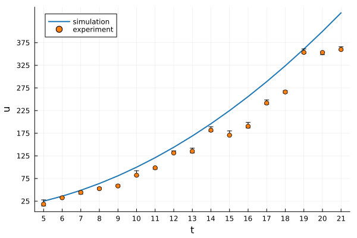

# Plots

This tutorial describes the following **Plots.jl** concepts: *backends*, *themes* and *color schemes*. 
These settings are useful both for visualizing HetaSimulator objects and any other data. For detailed information on basic **Plots.jl** usage please consult the [documentation](https://docs.juliaplots.org/stable/). 

The following artificial data and functions will be used to illustrate the tutorial:

```
using Plots, StatsPlots, Distributions

f(z) = z^2
x = 5:21
lenx = length(x)
y = [rand(Uniform(0.7,1))*f(xᵢ) for xᵢ in x]
yerr = (5*rand(lenx),10*rand(lenx))
Ybar = rand(1:10, 5, 2)
Ybarerr = (rand(5, 2),rand(5, 2))

function simulation_plot(; kwargs...)
  p = plot(; xticks = x, ytick=25:50:400, kwargs...)
  plot!(p, x, f; label="simulation", lw=2)
  scatter!(p, x, y; yerror=yerr, label="experiment")
end

function groupedbar_plot(; kwargs...)
  ctg = repeat(["Category 1", "Category 2"], inner = 5)
  nam = repeat("G" .* string.(1:5), outer = 2)

  groupedbar(nam, Ybar, group=ctg, xlabel = "Groups", ylabel = "Scores",
        title = "Scores by group and category", yerror=Ybarerr, framestyle = :box, kwargs...)
end

```

## Backends

**Plots.jl** is the single interface to different visualization backends (libraries). The choice of the backend depends on the task as each backend has it's strength and weaknesses. 
The full list of supported backends is provided in [Plots backends documentation](https://docs.juliaplots.org/stable/backends/). You can find some advices on backends usage on [Julia discourse](https://discourse.julialang.org/t/comparison-of-plotting-packages/99860/2). Here we will focus on the most popular backends.

### GR

[GR backend](https://github.com/jheinen/GR.jl) is set by default. It is fast and simple and should be preferred for basic visualization. If you are looking for advanced features or publication quality plots it may not suit you. It is installed with:
```
using Plots
gr()
simulation_plot()
groupedbar_plot()
```
 

### PlotlyJS

[PlotlyJS](http://juliaplots.org/PlotlyJS.jl/stable/) backend is good for interactive plots or webpages. You can both visualize the data and interactively get the values of data point on the plot. 
It can be installed with:
```
using Plots
plotlyjs()
simulation_plot()
```


### PGFPlotsX

[PGFPlotsX](https://kristofferc.github.io/PGFPlotsX.jl/stable/) backend uses LaTeX and it is considered the backend suitable for publications. PGFPlotsX requires a LaTeX installation (e.g. [MiKTeX](https://miktex.org/))
The package can be installed with:
```
pgfplotsx()
simulation_plot()
groupedbar_plot()
```
 


## Plot themes

One can adjust plot themes (background, etc) by changing the default theme. Other themes are described in the [PlotThemes.jl documentation](https://docs.juliaplots.org/stable/generated/plotthemes/)

## Color schemes

To set the color palette one can use [ColorSchemes.jl package](https://docs.juliaplots.org/stable/colorschemes) 