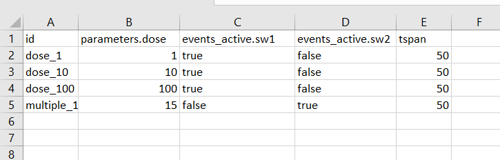

# Scenario. Simulation

## Working example

As an example we will use a model describing a simple two-compartment pharmacokinetic model stored in single __.heta__ file. It is expected that the model code will be placed into "index.heta" file located in the working directory.

File can be downloaded here: [index.heta](./sim-files/index.heta)

```julia
// Compartments
Vol0 @Compartment .= 1;
Vol1 @Compartment .= 6.3;
Vol2 @Compartment .= 10.6;

// Species
A0 @Species {compartment: Vol0, isAmount: true, output: true} .= 0;
C1 @Species {compartment: Vol1, output: true} .= 0;
C2 @Species {compartment: Vol2, output: true} .= 0;

// Reactions
v_abs @Reaction {actors: A0 = C1} := kabs * A0;
v_el @Reaction {actors: C1 =} := Vol1 * (kel * C1); // Vol1 * (kmax * C1 / (Km + C1));
v_distr @Reaction {actors: C1 = C2} := Q * (C1 - C2);

// Parameters
dose @Const = 20;
kabs @Const = 20;
kel @Const = 0.5;
Q @Const = 1.0;

// single dose event
sw1 @TimeSwitcher {start: 0};
A0 [sw1]= dose;

// multiple dose event, default off
sw2 @TimeSwitcher {start: 0, period: 24, active: false};
A0 [sw2]= dose;
```

The modeling platform includes only one namespace `nameless` which is the default one. After loading into HetaSimulator the single `Model` with id `:nameless` will be available.

```julia
using HetaSimulator, Plots

# create Platform from the project files
# "index.heta" file inside is the default entry point
p = load_platform(".")
```

```
No declaration file, running with defaults...
[info] Builder initialized in directory "Y:\HetaSimulator.jl\docs\src\tutorial\sim-files".
[info] Compilation of module "index.heta" of type "heta"...
[info] Reading module of type "heta" from file "Y:\HetaSimulator.jl\docs\src\tutorial\sim-files\index.heta"...
[info] Setting references in elements, total length 52
[info] Checking for circular references in Records.
[warn] Units checking skipped. To turn it on set "unitsCheck: true" in declaration.
[info] Checking unit's terms.
[warn] "Julia only" mode
[info] Exporting to "Y:\HetaSimulator.jl\docs\src\tutorial\sim-files\_julia" of format "Julia"...
Compilation OK!
Loading platform... OK!
Platform with 1 model(s), 0 scenario(s), 0 measurement(s)
   Models: nameless
   Scenarios: 
```

```julia
# get the default model
model = models(p)[:nameless]
```

```
Model contains 4 constant(s), 9 record(s), 2 switcher(s).
   Constants: dose, kabs, kel, Q
   Records: Vol0, Vol1, Vol2, A0, C1, C2, v_abs, v_el, v_distr
   Switchers (events): sw1, sw2
```

## Creating scenarios

`Scenario` in HetaSimulator is a type storing a model together with conditions and simulation settings like time-range, output variable, updated parameter values, activate or inactivate events, etc.

The scenario-based approach is used to store pre-defined model's options: dose values, experimental scenarios, data saving options, initial values and others which can be applied for one or multiple models. The `Scenario` also stores `Measurement` points which is used for parameters identification and visualization.

`Scenario` is created from default options passed from its model and user defined options from tables or set manually.

### Manual creation of Scenario

`Scenario` objects can be created and loaded directly from Julia environment.

The next code will create a `Scenario` for simulating the default model with time range from 0 to 10. The rest of options will be taken from default `:nameless` model:

- output records (observables) will be taken from records marked with `{output: true}` in heta code.
- all switchers (events) will be active if `{active: true}` is not set.
- constant values (parameters) will be the same as they stated in the heta file.

```julia
# minimal scenario
scenario0 = Scenario(model, tspan = (0, 10))
```

```
Scenario for tspan=(0.0, 10.0)
   Time range (tspan): (0.0, 10.0) 
   Parameters: dose, kabs, kel, Q
   Number of measurement points: 0
```

The scenario can be simulated from the scenario and plotted.
```julia
res0 = sim(scenario0)
plot(res0)
```


Creating scenario we can also update some of the model default options.
The next example is the case when we want to update the simulation conditions:

- Update value of constant `dose = 100`.
- Use multiple dose event `sw2` instead of single dose.
- simulation time is from `0` to `1000`.
- we need to observe all species: `C1`, `C2`, and reactions `v_el`.

The `Scenario` can be created with the following code:

```julia
# creating scenario
scenario1 = Scenario(
    model,
    parameters = [:dose=>100.],
    events_active = [:sw1=>false, :sw2=>true],
    tspan = (0.,50.),
    observables = [:C1, :C2, :v_el]
)
res1 = sim(scenario1)
plot(res1)
```


To read more about available options see API docs for [`Scenario`](@ref) function.

It is necessary to mention that `scenario0` and `scenario1` after creation are not parts of `p` platform. To add them into storage we can use the following syntax.

```julia
# push all into `scenarios` dictionary
add_scenarios!(p, [:scn0 => scenario0, :scn1 => scenario1])
```

where `:scn0` and `:scn` are identifiers for the scenarios in the dictionary.

As it can be seen now the model includes them.

```julia
p
```

```
Platform with 1 model(s), 2 scenario(s), 0 measurement(s)
   Models: nameless
   Scenarios: scn0, scn1
```

### Import scenarios from CSV tables

The most simple way to populate a platform by scenarios is to create a file with `Scenario` in [tabular CSV format](../table-formats/scenario.md).

Create file __scenarios.csv__ file inside the working directory with the following content.



File can be downloaded here: [scenarios.csv](./sim-files/scenarios.csv).

The table can be created in Excel, saved as a CSV file and then loaded with the [`read_scenarios`](@ref) function as a `DataFrame`.

```julia
scenarios_df = read_scenarios("scenarios.csv")
```

```
4×4 DataFrame
 Row │ id           parameters.dose  events_active.sw1  events_active.sw2 
     │ Symbol       Int64            Bool               Bool
─────┼────────────────────────────────────────────────────────────────────
   1 │ dose_1                     1               true              false
   2 │ dose_10                   10               true              false
   3 │ dose_100                 100               true              false
   4 │ multiple_15               15              false               true
```

The function reads the content of CSV file, checks components and stores in `scenarios_df` variable of `DataFrame` format. CSV files can be created with any other tools. User can also load tables from XLSX files using the same syntax.

The content of the `DataFrame` should be loaded into `Platform` object.

```julia
add_scenarios!(p, scenarios_df)
```

As we can see all 4 scenarios from the table were added.

```julia
p
```

```
Platform with 1 model(s), 6 scenario(s), 0 measurement(s)       
   Models: nameless
   Scenarios: scn0, scn1, dose_1, dose_10, dose_100, multiple_15
```

The particular scenario loaded directly into `Platform` can be obtained using the syntax.

```julia
scenario2 = scenarios(p)[:dose_1]
```

```
Scenario for tspan=(0.0, 50.0)
   Time range (tspan): (0.0, 50.0)
   Parameters: dose, kabs, kel, Q
   Number of measurement points: 0
```

See more about scenario tables in [tabular CSV format](../table-formats/scenario.md).

## Single scenario simulations

The base [`sim`](@ref) method is applied for a `Scenario` object.
This object can be created directly using `Scenario` constructor or taken from `Platform` object.

The result of `sim` function execution is solution of ODE with parameters passed from (1) `Model` content and default settings, (2) settings passed from created `Scenario` object and (3) additional settings from `sim` function. 

```julia
res2 = sim(scenario2)
```

```
315x3 SimResult with status :Success.
    Solution status: Success
    Time points (times): 0.0, 0.0, 0.0, 4.999950000250002e-7, 5.499945000275002e-6, 5.549944500277502e-5, 0.0005554944450277752, 0.0031405418644452152, 0.007928302918050478, 0.014985582147596817, ...
    Observables (outputs): C1, C2, v_el
    Parameters:
```

`sim` method applied for a single `Scenario` returns object of type [`HetaSimulator.SimResult`](@ref). 
The method has the additional arguments which can set the integration methods and other options. For more information see [`sim`](@ref)

The results can be visualized using `plot` recipe which create the default representation of `SimResult` content. 

```julia
# plot all
plot(res2)
```


The figure displays all simulated points and all output variables declared in `observables` of the scenario.
A user can select chosen observables for displaying. The other general `plot` arguments like `yscale`, `ylim` and others can be used.

```julia
# plot C1, C2
plot(res2, vars = [:C1, :C2])
```


The results can be transformed into `DataFrame` object for further modifications and saving.

```julia
# for all observables
res_df = DataFrame(res1)
```

```
315×5 DataFrame
 Row │ t             C1           C2           v_el          scope  
     │ Float64       Float64      Float64      Float64       Symbol 
─────┼──────────────────────────────────────────────────────────────
   1 │  0.0          0.0          0.0           0.0          start_
   2 │  0.0          0.0          0.0           0.0          ode_
   3 │  0.0          0.0          0.0           0.0          sw2
   4 │  4.99995e-7   0.000158728  3.74355e-12   0.000499992  ode_
  ⋮  │      ⋮             ⋮            ⋮            ⋮          ⋮
 312 │ 49.4347       6.63602      1.77171      20.9035       ode_
 313 │ 49.6571       5.79124      1.86371      18.2424       ode_
 314 │ 49.8827       5.05502      1.93842      15.9233       ode_
 315 │ 50.0          4.71407      1.97083      14.8493       ode_
                                                    307 rows omitted
```

As in plot method the observables can be selected by the optional `vars` argument.

```julia
# for C1, C2
res_df = DataFrame(res1, vars = [:C1, :C2])
```

To save the table into a file the CSV file format can be used.

```julia
using CSV

# save to file
CSV.write("export_df.csv", res_df)
```

## Multiple scenario simulations

There is an approach to simulate multiple conditions simultaneously. 
`sim` can be applied for all or selected `Scenario`s in a platform.

```julia
# all scenarios
res_mult = sim(p)
```

```
Progress: 100%[==================================================] Time: 0:00:01        
6-element Vector{Pair{Symbol, SimResult}}
    :scn0 => 84x3 SimResult with status :Success.
    :scn1 => 315x3 SimResult with status :Success.
    :dose_1 => 81x3 SimResult with status :Success.
    :dose_10 => 100x3 SimResult with status :Success.
    :dose_100 => 124x3 SimResult with status :Success.
    :multiple_15 => 227x3 SimResult with status :Success.
```

The result of the method applied for a platform will be a vector of pairs `Symbol` identifier vs `SimResult`.
To obtain the particular sim result a user can use numerical or symbol indexing.

```julia
# to get 2d result
res_mult[2][2]
```

```
315x3 SimResult with status :Success.
    Solution status: Success
    Time points (times): 0.0, 0.0, 0.0, 4.999950000250002e-7, 5.499945000275002e-6, 5.549944500277502e-5, 0.0005554944450277752, 0.0031405418644452152, 0.007928302918050478, 0.014985582147596817, ...
    Observables (outputs): C1, C2, v_el
    Parameters: 
```

```julia
# get results for multiple_15 Scenario
res_mult[:multiple_15][2]
```

```
227x3 SimResult with status :Success.
    Solution status: Success
    Time points (times): 0.0, 0.0, 0.0, 3.3331111185190124e-6, 3.666422230370913e-5, 0.00036997533415561033, 0.003174221862346261, 0.008946283182509052, 0.01702472658406691, 0.028016975164716275, ...
    Observables (outputs): A0, C1, C2
    Parameters: 
```

To simulate the selected scenarios one can use `scenarios` argument.

```julia
res_selected = sim(p, scenarios = [:dose_1, :dose_10, :dose_100])
```

The results of multiple simulations can be visualized all together using `plot` method.

```julia
# plot everything
plot(res_selected, yscale=:log10, ylims=(1e-3,1e2))
```


The generated figure includes all condition simulations titled with scenario identifier. The additional arguments as `vars` and plot options can be used as well.

`sim` results applied for multiple scenario can be translated into `DataFrame`.

```julia
# convert everything into DataFrame
res_selected_df = DataFrame(res_selected)
CSV.write("res_selected_df.csv", res_selected_df)
```

## Final remarks

1. The typical workflow for simulation of modeling platforms in HetaSimulator.jl consists of the following steps: (1) loading Heta-based models into a `Platform` object; (2) creating and addition scenarios using `Scenario` constructor or from CSV tables; (3) run `sim` method for the whole platform or for selected scenarios; (4) display results using `plot` or transform into `DataFrame`.

1. `Model` and `Scenario` objects are "un-mutable". This means a user cannot update their parts directly. User can only create new Scenario and use `add_scenarios!` method using the same identifiers. This replaces the previous scenarios with selected ids.

1. To update a model structure one should include changes into source Heta-based model and repeat all the steps.

1. In many cased the chain Julia syntax can be useful. The following code creates the default scenario, simulate and plot with one line.

```julia
Scenario(models(p)[:nameless], tspan = (0,100)) |> sim |> plot
```

1. `plot` method for `SimResult` gives only a simple default representation. For extended graphics a user can transform everything into a `DataFrame` and plot manually.

1. For multiple simulations of the Monte-Carlo type one should use `mc` method instead of `sim` method. `Scenario` is not the same as single simulation task in Monte-Carlo.
