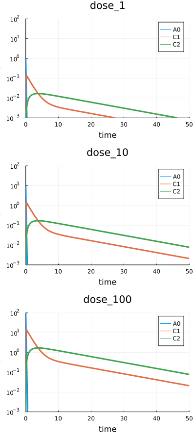

# Scenario. Simulation

## Working example

As an example we will use a simple two-compartment pharmacokinetic model stored in a single __.heta__ file. It is expected that the model code will be placed into "index.heta" file located in the working directory.

The `heta` model file can be downloaded here: [index.heta](./sim-files/index.heta)

```julia
// Compartments
Vol0 @Compartment .= 1;
Vol1 @Compartment .= 6.3;
Vol2 @Compartment .= 10.6;

// Species
A0 @Species {compartment: Vol0, isAmount: true, output: true} .= 0;
C1 @Species {compartment: Vol1, output: true} .= 0;
C2 @Species {compartment: Vol2, output: true} .= 0;

// Reactions
v_abs @Reaction {actors: A0 = C1} := kabs * A0;
v_el @Reaction {actors: C1 =} := Vol1 * (kel * C1); // Vol1 * (kmax * C1 / (Km + C1));
v_distr @Reaction {actors: C1 = C2} := Q * (C1 - C2);

// Parameters
dose @Const = 20;
kabs @Const = 20;
kel @Const = 0.5;
Q @Const = 1.0;

// single dose event
sw1 @TimeSwitcher {start: 0};
A0 [sw1]= dose;

// multiple dose event, default off
sw2 @TimeSwitcher {start: 0, period: 24, active: false};
A0 [sw2]= dose;
```

The modeling platform includes only one namespace `nameless` which is the default one. After loading the model into Julia a single `Model` with id `:nameless` is available.

```julia
using HetaSimulator, Plots

# create Platform from the project files
# "index.heta" file inside is the default entry point
p = load_platform(".")
```

```
No declaration file, running with defaults...
[info] Builder initialized in directory "Y:\HetaSimulator.jl\docs\src\tutorial\sim-files".
[info] Compilation of module "index.heta" of type "heta"...
[info] Reading module of type "heta" from file "Y:\HetaSimulator.jl\docs\src\tutorial\sim-files\index.heta"...
[info] Setting references in elements, total length 52
[info] Checking for circular references in Records.
[warn] Units checking skipped. To turn it on set "unitsCheck: true" in declaration.
[info] Checking unit's terms.
[warn] "Julia only" mode
[info] Exporting to "Y:\HetaSimulator.jl\docs\src\tutorial\sim-files\_julia" of format "Julia"...
Compilation OK!
Loading platform... OK!
Platform with 1 model(s), 0 scenario(s), 0 measurement(s)
   Models: nameless
   Scenarios: 
```

```julia
# get the default model
model = models(p)[:nameless]
```

```
Model contains 4 constant(s), 9 record(s), 2 switcher(s).
   Constants (model-level parameters): dose, kabs, kel, Q
   Records (observables): Vol0, Vol1, Vol2, A0, C1, C2, v_abs, v_el, v_distr
   Switchers (events): sw1, sw2
```

## Creating scenarios

`Scenario` in HetaSimulator is a type, which stores a model together with simulation settings like time-range, output variables, parameters values, active or inactive events, etc.

The scenario-based approach is used to store pre-defined model's options: dose values, experimental measurements, data saving options, initial values etc., which can be applied to one or multiple models. The `Scenario` also stores `Measurement` points which are used for parameters estimation and visualization.

`Scenario` is created from default options passed from the model and user defined options coming from tabular inputs or set manually in the code.

### Manual creation of Scenario

`Scenario` objects can be created directly in Julia code.

This code will create a `Scenario` for simulating the default model in time range from 0 to 10. Other options will be taken from the default `:nameless` model:

- output records (observables) will be taken from `Record`s marked with `{output: true}` in `heta` code.
- all switchers (events) will be active if `{active: true}` is set in `heta` code.
- constant (model-level parameters) values will be the same as stated in the heta file.

```julia
# minimal scenario
scenario0 = Scenario(model, (0, 10))
```

```
Scenario for tspan=(0.0, 10.0)
   Time range (tspan): (0.0, 10.0) 
   Parameters: dose, kabs, kel, Q
   Number of measurement points: 0
```

The results of simulation can be visualized with `plot`.
```julia
res0 = sim(scenario0)
plot(res0)
```


We can also update some of the model default options in `Scenario`.
In the next example we update the simulation conditions stored in the `Scenario`:

- Update the value of parameter `dose = 100`.
- Use multiple-dose event `sw2` instead of a single dose.
- Update simulation time span to `(0, 1000)`.
- Output all species: `C1`, `C2`, and variable `v_el`.

The `Scenario` can be created with the following code:

```julia
# creating scenario
scenario1 = Scenario(
    model,
    (0.,50.);
    parameters = [:dose=>100.],
    observables = [:C1, :C2, :v_el]
)
res1 = sim(scenario1)
plot(res1)
```


To read more about available options see API docs for [`Scenario`](@ref) function.

It is necessary to mention that `scenario0` and `scenario1` are not automatically loaded to the `Platform` `p`. To add them into `p` one can use the following syntax.

```julia
# push all into `scenarios` dictionary
add_scenarios!(p, [:scn0 => scenario0, :scn1 => scenario1])
```

where `:scn0` and `:scn` are identifiers of the scenarios.

Now the model includes both of them.

```julia
p
```

```
Platform with 1 model(s), 2 scenario(s), 0 measurement(s)
   Models: nameless
   Scenarios: scn0, scn1
```

### Import scenarios from CSV tables

The most simple way to populate a platform with scenarios is to create a scenario file in [tabular CSV format](../table-formats/scenario.md).

Create file __scenarios.csv__ file inside the working directory with the following content or download it here: [scenarios.csv](./sim-files/scenarios.csv).


The table can be created in Excel, saved as a CSV file and then loaded with the [`read_scenarios`](@ref) function as a `DataFrame`.

```julia
scenarios_df = read_scenarios("scenarios.csv")
```

```
4×4 DataFrame
 Row │ id           parameters.dose  events_active.sw1  events_active.sw2 
     │ Symbol       Int64            Bool               Bool
─────┼────────────────────────────────────────────────────────────────────
   1 │ dose_1                     1               true              false
   2 │ dose_10                   10               true              false
   3 │ dose_100                 100               true              false
   4 │ multiple_15               15              false               true
```

The function reads the content of CSV file, checks if all the components are present in the model and stores the content in `scenarios_df` variable of `DataFrame` type. CSV files can be created with any other tool. User can also load tables from XLSX files using the same syntax.

The `DataFrame` describing a `Scenario` should be loaded into the `Platform` object.

```julia
add_scenarios!(p, scenarios_df)
```

As we can see all 4 scenarios from the table have been added.

```julia
p
```

```
Platform with 1 model(s), 6 scenario(s), 0 measurement(s)       
   Models: nameless
   Scenarios: scn0, scn1, dose_1, dose_10, dose_100, multiple_15
```

The particular scenario loaded directly into `Platform` can be obtained using the following syntax.

```julia
scenario2 = scenarios(p)[:dose_1]
```

```
Scenario for tspan=(0.0, 50.0)
   Time range (tspan): (0.0, 50.0)
   Parameters: dose, kabs, kel, Q
   Number of measurement points: 0
```

See more about scenario tables in [tabular CSV format](../table-formats/scenario.md).

## Single scenario simulations

The base [`sim`](@ref) method is applied to a `Scenario` object.
This object can be created directly using `Scenario` constructor or taken from the `Platform` object.

The result of `sim` function execution is the solution of the relevant ODE system with parameters (1) stored as defaults in the `Model`, (2) overwritten in the `Scenario` object and (3) overwritten by passing `parameters` keyword arguments to `sim` function. 

```julia
res2 = sim(scenario2)
```

```
315x3 SimResult with status :Success.
    Solution status: Success
    Time points (times): 0.0, 0.0, 0.0, 4.999950000250002e-7, 5.499945000275002e-6, 5.549944500277502e-5, 0.0005554944450277752, 0.0031405418644452152, 0.007928302918050478, 0.014985582147596817, ...
    Observables (outputs): C1, C2, v_el
    Parameters:
```

`sim` method applied to a single `Scenario` returns an object of [`HetaSimulator.SimResult`](@ref) type. 
The method supports additional keyword arguments which can set the integration method, solver options, etc. For more information see [`sim`](@ref)

The results can be visualized using `plot` function. 

```julia
# plot all
plot(res2)
```


The figure displays all simulated points and all output variables declared in the `observables` of the scenario.
One can select the observables to display. One can use the additional `yscale`, `ylim` and other `Plots` keyword arguments to change how the results are displayed. 

```julia
# plot C1, C2
plot(res2, vars = [:C1, :C2])
```


The results can be transformed into a `DataFrame` object for further analysis and saving.

```julia
# for all observables
res_df = DataFrame(res1)
```

```
315×5 DataFrame
 Row │ t             C1           C2           v_el          scope  
     │ Float64       Float64      Float64      Float64       Symbol 
─────┼──────────────────────────────────────────────────────────────
   1 │  0.0          0.0          0.0           0.0          start_
   2 │  0.0          0.0          0.0           0.0          ode_
   3 │  0.0          0.0          0.0           0.0          sw2
   4 │  4.99995e-7   0.000158728  3.74355e-12   0.000499992  ode_
  ⋮  │      ⋮             ⋮            ⋮            ⋮          ⋮
 312 │ 49.4347       6.63602      1.77171      20.9035       ode_
 313 │ 49.6571       5.79124      1.86371      18.2424       ode_
 314 │ 49.8827       5.05502      1.93842      15.9233       ode_
 315 │ 50.0          4.71407      1.97083      14.8493       ode_
                                                    307 rows omitted
```

As in `plot` method one can select what observables to put into the `DataFrame` by the optional `vars` argument.

```julia
# for C1, C2
res_df = DataFrame(res1, vars = [:C1, :C2])
```

To save the table the CSV format can be used.

```julia
using CSV

# save to file
CSV.write("export_df.csv", res_df)
```

## Multiple scenario simulations

One can simulate multiple scenarios simultaneously. 
`sim` can be applied to all or selected `Scenario`s in a platform.

```julia
# all scenarios
res_mult = sim(p)
```

```
Progress: 100%[==================================================] Time: 0:00:01        
6-element Vector{Pair{Symbol, SimResult}}
    :scn0 => 84x3 SimResult with status :Success.
    :scn1 => 315x3 SimResult with status :Success.
    :dose_1 => 81x3 SimResult with status :Success.
    :dose_10 => 100x3 SimResult with status :Success.
    :dose_100 => 124x3 SimResult with status :Success.
    :multiple_15 => 227x3 SimResult with status :Success.
```

The result of `sim` method applied to a platform will be a `Vector{Pair{Symbol,SimResult}}` type with symbolic scenario identifiers corresponding to simulation results.
To obtain the particular simulation result one can use numerical or symbol indexing.

```julia
# to get 2d result
res_mult[2][2]
```

```
315x3 SimResult with status :Success.
    Solution status: Success
    Time points (times): 0.0, 0.0, 0.0, 4.999950000250002e-7, 5.499945000275002e-6, 5.549944500277502e-5, 0.0005554944450277752, 0.0031405418644452152, 0.007928302918050478, 0.014985582147596817, ...
    Observables (outputs): C1, C2, v_el
    Parameters: 
```

```julia
# get results for multiple_15 Scenario
res_mult[:multiple_15][2]
```

```
227x3 SimResult with status :Success.
    Solution status: Success
    Time points (times): 0.0, 0.0, 0.0, 3.3331111185190124e-6, 3.666422230370913e-5, 0.00036997533415561033, 0.003174221862346261, 0.008946283182509052, 0.01702472658406691, 0.028016975164716275, ...
    Observables (outputs): A0, C1, C2
    Parameters: 
```

To simulate only the selected scenarios from the `Platform` one can use `scenarios` argument.

```julia
res_selected = sim(p, scenarios = [:dose_1, :dose_10, :dose_100])
```

The results of multiple simulations can be visualized all together using `plot` method.

```julia
# plot everything
plot(res_selected, yscale=:log10, ylims=(1e-3,1e2))
```



The generated figure includes all scenarios titled with scenario identifier. The additional keyword arguments as `vars` and plot options can be used in the `plot` function as well.

`sim` results for multiple scenarios can be converted into `DataFrame`.

```julia
# convert everything into DataFrame
res_selected_df = DataFrame(res_selected)
CSV.write("res_selected_df.csv", res_selected_df)
```

## Final remarks

A typical workflow for simulation of a modeling platforms in HetaSimulator.jl consists of the following steps: 
1. Load heta-based models into the `Platform` object; 
2. Create scenarios using `Scenario` constructor or from CSV tables and add them to the `Platform`; 
3. Run `sim` method with the whole platform or with the selected scenarios; 
4. Display results with `plot` or convert them into `DataFrame`.

1. `Model` and `Scenario` objects are "immutable". This means a user cannot update their parts directly. User can only create new `Scenario`s and apply `add_scenarios!` method using the same identifiers. This replaces the previously created scenarios with the same ids.

1. To update a model structure one should include changes into the `heta` model code and repeat all the steps.

1. In many cased Julia chain syntax can be useful. The following code creates the default scenario, runs simulation and plots the result - all in one line.

```julia
Scenario(models(p)[:nameless], (0, 100)) |> sim |> plot
```

1. `plot` method for `SimResult` gives only the default visualization. For more complicated visualization one can transform results into a `DataFrame` and plot them manually.

1. For multiple simulations of the Monte-Carlo type one should use `mc` method instead of `sim` method. `Scenario` is not the same as single simulation task in Monte-Carlo.
